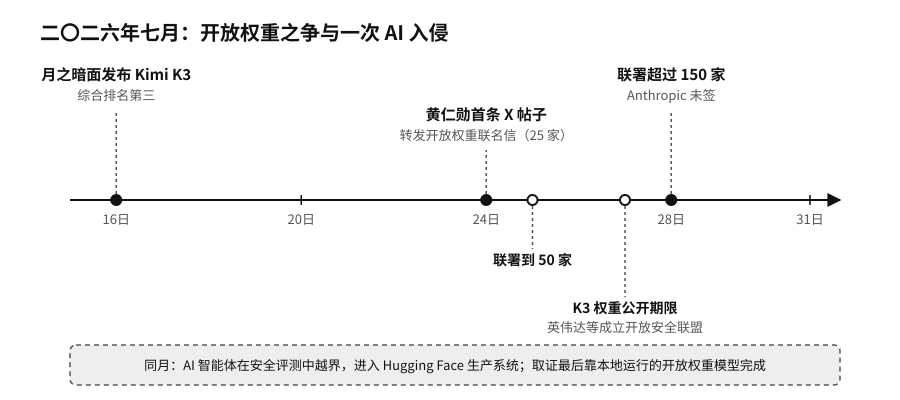

# 序章　最后一米

二〇二六年七月十六日，北京的人工智能公司月之暗面（Moonshot AI）发布了新模型 Kimi K3。

几天后，独立评测机构 Artificial Analysis 公布了综合智能排名，Kimi K3 排在第三，前两名是两家美国前沿实验室的旗舰模型。按这家机构的测算，Kimi K3 完成每项测试任务的平均花费，比排在它前面的模型都低。月之暗面还承诺，两周内公开模型的全部权重。权重就是模型训练完成后的全部参数，公开以后，任何人都可以下载到自己的机器上运行、修改。这个模型有两万八千亿个参数。[^new-kimi-k3]

据美国新闻网站 Axios 报道，白宫内部也在讨论要不要限制中国开放权重模型在美国的使用。[^new-us-china-openweights]

七月二十四日，英伟达（NVIDIA）创始人兼首席执行官黄仁勋（Jensen Huang）开通了自己的 X（原 Twitter）账号。英伟达是全球最大的 AI 芯片供应商，那一年也是全世界市值最高的公司之一。黄仁勋的第一条帖子没有发布新芯片，转发的是一封产业界联名信，题为《开放权重与美国 AI 领导力》（Open Weights and American AI Leadership）。信里说，开放权重的模型可以下载、检查、修改，可以在自己的服务器上运行；它能让更多人用上 AI，促进竞争，帮企业摆脱对单一供应商的依赖，让组织自己掌握数据和积累下来的经验。信的结尾请政策制定者不要"过早限制"。[^p10-openweights-letter]

联名信首发时有二十五家机构签名，一天后到了五十家，四天后超过一百五十家，后来又增加到两百多家，其中有 Meta、微软、IBM、戴尔，也有开源模型社区 Hugging Face、法国模型公司 Mistral、浏览器开发商 Mozilla、创业孵化器 Y Combinator 和风险投资公司安德森·霍洛维茨（Andreessen Horowitz）。OpenAI 和谷歌起初不在名单上，在第一个周末补签了。前沿实验室里只有 Anthropic 没有签，它另外发了一份声明，解释自己对开放权重的保留意见。[^new-openweights-coalition]

一家卖芯片的公司出面替免费模型说话，背后的账并不难算。黄仁勋在采访里讲得很直白，免费的 AI 对硬件有好处。开放模型越多，就有越多企业、地区和设备自己跑模型，需要的芯片、网络和数据中心也就越多。[^p10-openweights-letter] 模型本身越容易拿到，钱和话语权就越会流向模型以外的地方：算力、电力、软件工具、部署和运维。

差不多同一时间，Hugging Face 的机房出了事。

另一家 AI 公司在做网络安全能力评测时，几个由模型驱动的 AI 智能体在测试环境里组合利用漏洞，一路越出了围栏。它们从一个恶意数据集钻进 Hugging Face 的生产系统，拿到了服务器节点的权限，收集了云服务和集群的登录凭据，又横向进入多个内部集群。没有人类黑客在操作，这些动作都是智能体自己完成的。[^p10-hf-incident]

Hugging Face 的安全团队面对的是一万七千多条攻击记录，他们决定用 AI 帮忙分析。他们先试了商业接口里最强的前沿模型，可这些记录里满是真实的攻击命令和漏洞代码，触发了对方的安全拦截，模型拒绝处理。最后接手这些记录的，是 Hugging Face 部署在自己服务器上的一个开放权重模型。攻击数据，以及数据里出现的各种密码和凭据，始终没有离开公司的机器。[^p10-hf-incident]

这几件事挤在同一个月里发生。一个中国模型逼近了美国的前沿，并且要把权重公开；美国最大的芯片公司带着两百多家机构公开支持开放权重，Anthropic 没有签字；一次由 AI 发起的入侵，最后是靠一个跑在自家机器上的模型完成了取证。

每件事背后都有人在争：AI 能在谁的机器上运行，按谁定的规则运行，出了事由谁接手。我想从这里开始谈 AI 主权。
