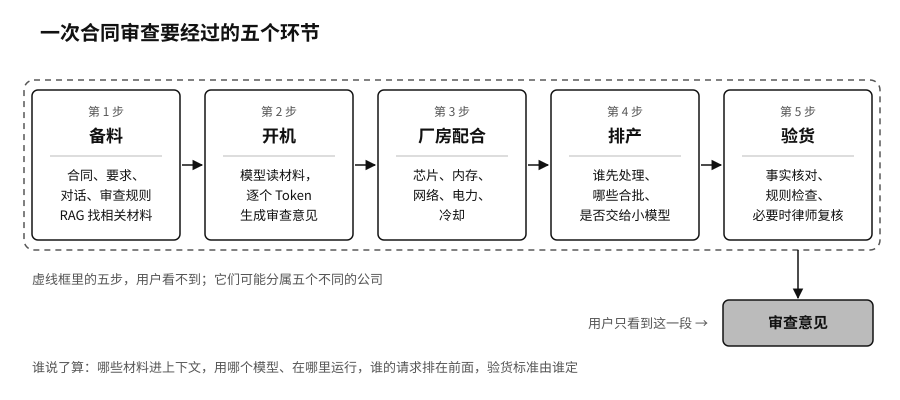

## 一份合同走过的五道工序

“Token 工厂”指的是从接到问题到交出结果的整条生产线，不只是摆满芯片的那栋楼。拿一个具体任务来走一遍：一家公司让 AI 审查一份合同。

第一步是备料。系统收集合同原文、用户的要求、之前的对话，还有公司自己的审查规则。模型训练时读过大量文本，却不知道这份合同昨天刚改了哪一条，也不知道这家公司今天执行什么标准。这时要用到一种叫检索增强生成（RAG）的做法：先从公司的资料库里找出相关材料，临时放到模型手边。

第二步是开机。训练好的模型读这些材料，一个 Token 一个 Token 地生成审查意见。

第三步是厂房配合。芯片负责计算，内存存放模型和中间结果，网络在芯片之间搬数据，电力驱动设备，冷却系统把热量带走。任何一处跟不上，回答就会变慢、变贵，甚至停掉。

第四步是排产。同一时刻有很多请求在排队，调度程序要决定谁先处理，哪些请求合并成一批一起算，简单的问题是不是交给便宜的小模型。加州大学伯克利分校团队开发的 vLLM 推理软件，靠改进内存的分配方式，在测试条件下，同样硬件上的吞吐量是当时最先进同类系统的二到四倍。[^p1-paged-attention] 芯片一张没换，单位 Token 的成本就降了下来。

第五步是验货。生成的意见要经过事实核对、业务规则检查，必要时由律师复核。如果漏掉了关键风险，前面生成得再流畅，也只是把错误更快地送到用户面前。

用户只看到最后那段回答，看不到这五步分别由谁说了算：哪些材料能进上下文，用哪个模型、在哪里运行，谁的请求排在前面，验货标准由谁定。这五个环节可能分属五个不同的公司。依赖就是在这些看不见的环节里形成的。
