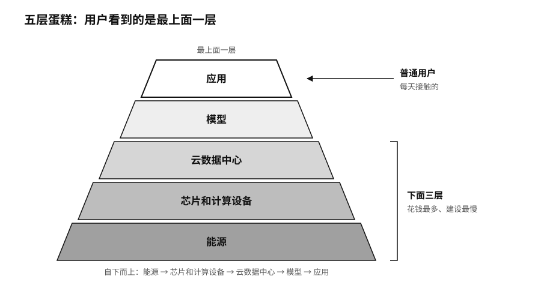

## 电比芯片更缺

Token 看上去很轻，出现在屏幕上，没有重量，复制起来几乎不花钱。生产它的工厂却越来越重。

微软在威斯康星州建的 Fairwater 数据中心园区，占地约三百一十五英亩，用了约两千六百五十万磅结构钢、一百二十英里中压地下电缆和七十二点六英里机械管道，初始投资承诺三十三亿美元。[^p1-token-factory-builds]

电力是更大的约束。二〇二四年，全球数据中心用电约四百一十五太瓦时；国际能源署预计，到二〇三〇年可能增加到约九百四十五太瓦时，AI 是主要推动力之一。[^p1-iea-energy] 在美国，能源部和劳伦斯伯克利国家实验室估计，数据中心二〇二三年已经用掉全国约百分之四点四的电，到二〇二八年可能升到百分之六点七至十二。[^p1-infra-2026] 芯片之外，高带宽内存、光模块、液冷设备、变压器、备用电源、土地和电网接入，样样都可能卡住进度。

英伟达喜欢用一个“五层蛋糕”来描述这个产业：最底层是能源，往上依次是芯片和计算设备、云数据中心、模型，最上面是应用。[^p7-five-layer-cake] 普通用户每天接触的是最上面一层，花钱最多、建设最慢的却是下面三层。

序章提到，英伟达已经开始替 OpenAI 担保俄亥俄州一个四点二五吉瓦园区的租金和电费。黄仁勋在宣布这件事的长文里说，前沿实验室的增长越来越受限于能不能拿到足够的算力，而不是算法或需求；土地、电力和厂房正变得和先进芯片一样关键。[^p1-nvidia-lps-2026] 这几样东西要靠长达二十年的合同才能锁定，能签得起这种合同的公司，全世界没有几家。

用户这边的感受正好相反，AI 越来越便宜了。序章提到的价格下跌出自斯坦福《AI 指数报告》的统计：达到 GPT-3.5 水平的模型，每百万 Token 的公开价格从二〇二二年十一月的约二十美元，降到二〇二四年十月的约七美分，降幅超过两百八十倍。[^p1-inference-cost]

工厂越来越重，产品越来越便宜，这两件事并不矛盾。芯片、模型和推理软件都在进步，单次调用的价格被压了下来；价格一降，就有更多人、更多业务开始调用模型，调用总量反而大幅上升。电力和电信都走过类似的路：单位服务越来越便宜，社会也越来越离不开背后那张网。

能力在扩散，生产却在集中。斯坦福的统计显示，二〇二五年全球九成以上有代表性的 AI 模型出自企业。[^p1-ai-index-2026] 英国竞争与市场管理局（CMA）的调查发现，在英国和欧洲经济区的云基础设施市场，微软和亚马逊云（AWS）二〇二四年各占约三到四成，每年真正更换云服务商的客户不到百分之一。[^p1-cma-cloud] 数据搬家的费用、工程师的技能和多年积累的配置，都会把客户留在原来的平台上。

重资产也有它的陷阱。这几年，各地纷纷建设自己的智算中心，报表上的算力规模节节攀升，可如果没有足够的真实业务来用，这些设备最后只会变成沉没成本。工厂再大，也得有订单在里面流动。

模型造出来以后，还要通过各种渠道送到普通人和普通企业手里。谁能用上 AI，很大程度上由这些渠道决定。
