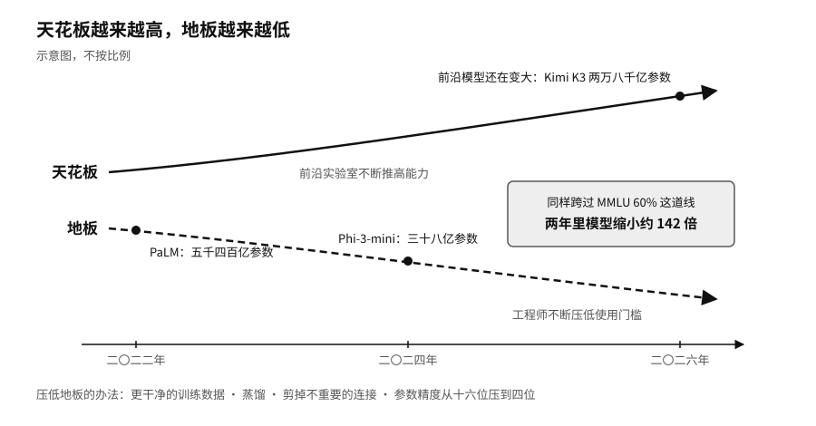

## 两极分化：前沿大模型与端侧小模型

二〇二四年，一个三十八亿参数的模型装进了手机。微软在 Phi-3 技术报告里说，这个小模型在一项覆盖多学科的选择题测试（MMLU）里得分约百分之六十九。同一年，苹果公布的端侧模型约三十亿参数，在 iPhone 15 Pro 上每秒能生成约三十个 Token。[^p2-device-models]

另一头，前沿模型还在变大。序章提到的 Kimi K3 有两万八千亿个参数，深度求索的 V4-Pro 有一万六千亿个。

这两件事并不矛盾。斯坦福的统计显示，要在 MMLU 上跨过百分之六十这道线，二〇二二年需要谷歌五千四百亿参数的 PaLM，到二〇二四年，三十八亿参数的 Phi-3-mini 就做到了，两年里缩小了约一百四十二倍。[^p2-two-frontiers] 前沿实验室在不断推高能力的天花板，工程师则在不断压低使用的地板。一项能力一旦被证明可行，就会有人想办法用更少的资源再做一遍，靠的是更干净的训练数据、蒸馏、剪掉不重要的连接，以及把参数的精度从十六位压到四位甚至更低。

模型的“大小”也不再是一个简单的数字。今天的大模型多采用“混合专家”结构。Kimi K3 内部有八百九十六组“专家”，处理每一个 Token 时只叫十六组来干活，两万八千亿个参数里实际参与计算的约一千零四十亿。可以把总参数想成一家公司的全部专家，把激活参数想成这次被叫进会议室的人。到会的人少，不代表会开得快：全部专家的资料都得存着，调度和通信也要花时间。[^p2-frontier-models-2026]

于是一套真正投入使用的 AI 系统，往往大小模型搭配着用。手机或公司内网里的小模型先做录音转写、文字识别、分类和去掉个人信息，少数难题再交给云端的大模型，金额和格式交给普通程序去核对，付款和发布这种撤不回的决定留给人。阿里巴巴的通义千问第三代（Qwen3）一口气发布了从六亿参数到两千三百五十亿参数的一整个家族，就是为了让不同的位置各有合适的模型可用。[^p2-small-model-family-2026]

能力从大模型流到小模型时，有一样东西经常丢掉：来历。瑞士的 Apertus 项目做了一个对照。二〇二五年九月，苏黎世联邦理工学院、洛桑联邦理工学院和瑞士国家超级计算中心发布了八十亿和七百亿参数的 Apertus 模型，训练语料覆盖一千多种语言。他们公开的不只是权重，还有训练和评测代码、数据处理过程和中间版本。[^p2-apertus] 二〇二六年六月，团队又以八十亿参数的模型为老师，蒸馏出几个更小的模型，每一步都有记录。[^p2-apertus-mini]

一个用户拿到 Apertus 的小模型，能查到它从哪个老师学来，老师用了什么数据，中间做过哪些压缩。一个用闭源模型的回答训练出来的小模型，就算本事差不多，这些问题一个也答不上来。哪天模型出了问题，或者需要按本国语言重新训练，前者的使用者知道从哪里下手。
