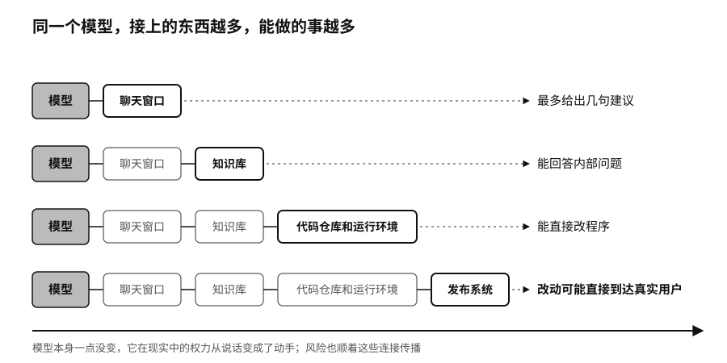

## 排行榜不告诉你的事

模型排行榜不会告诉你，一个 AI 助手能不能读公司邮箱，有没有生产数据库的写入权限，能不能不经人批准就直接发布代码。这些连接不在模型里，却决定了这个系统在现实中能做多少事。

同一个模型，只接一个聊天窗口，最多给出几句建议；接上公司的知识库，能回答内部问题；接上代码仓库和运行环境，能直接改程序；再接上发布系统，改动就可能直接到达真实用户。模型本身一点没变，它在现实中的权力从说话变成了动手。

风险也顺着这些连接传播。一封邮件里藏着一句恶意指令，模型读到以后可能把它当成任务去执行；工具手里握着真实的账号和密码，一句话里的欺骗就变成了真实的损失。

工具通常比模型“笨”，后果却更大。数据库接口不懂公司战略，一条写入指令就能改掉库存；支付接口不懂一个家庭的处境，一次调用就能把钱转走。

各家的模型、数据和工具要连在一起，就需要共同的接口标准。模型上下文协议（Model Context Protocol，简称 MCP）是 Anthropic 发起的一套让模型接入外部工具和数据的接口；A2A 是谷歌发起的、让不同公司的智能体互相沟通的协议。A2A 在二〇二五年四月发布时有五十多家机构支持，到二〇二六年四月超过一百五十家。二〇二五年十二月，MCP 也交给了 Linux 基金会旗下的智能体 AI 基金会管理。[^p2-agent-protocols] 产业竞争正在从“谁的模型最强”，延伸到“谁来定义模型怎样连接世界”。

统一的接口让组织更容易换模型、组合多家服务，也给攻击者提供了一条现成的通道。被污染的网页、文档，或者权限过大的工具，都可能借智能体之手，穿过原本彼此隔开的系统。

到二〇二六年，能不能用上 AI 已经不难了：模型可以下载，可以蒸馏到手机里，可以在本地和云上随意组合，还能接上数据和工具去做事。能力这样摊开以后，一个人、一家公司和别人之间还剩什么差别？机器替你做事的时候，控制权又握在谁手里？
