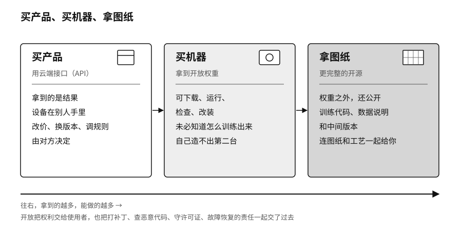

## 开放打开的是哪一道门

序章讲到的那封开放权重联名信发出三天后，英伟达又联合一批云计算、网络安全和开源机构成立了开放安全 AI 联盟（Open Secure AI Alliance），要一起建设用于 AI 安全的开放模型和工具。[^new-open-secure-alliance]

“开源”这个词在 AI 领域被用得很乱。两个都自称开源的模型，一个只让你调用它的接口，另一个让你下载权重、查看训练数据、修改以后再发布。把它们叫同一个名字，就像把参观工厂、买一台机器和拿到整条生产线的图纸当成一回事。

可以分三种情况来看。通过云端接口（API）用模型，好比从别人的工厂买产品，你拿到的是结果，设备在别人手里，对方改价格、换版本、调整规则，你只能在合同允许的范围内应对。拿到开放权重，好比买下一台已经造好的机器，你可以在许可范围内下载、运行、检查和改装它，放在自己的机器上或自己选的云上，但你未必知道它用什么数据训练、怎么训练出来的，自己也造不出第二台。更完整的开源，还要公开训练代码、数据说明和中间版本，相当于连图纸和工艺一起给你。开放源代码促进会（OSI）在二〇二四年发布了开源 AI 的正式定义，标准就是看这些材料给没给全。[^p10-open-definitions]

| 你能做什么 | 用云端接口 | 拿到开放权重 | 更完整的开源 |
|---|---|---|---|
| 保存模型本身 | 通常不能 | 通常可以 | 可以 |
| 放在自己的机器上运行 | 通常不能 | 通常可以 | 可以 |
| 修改模型的行为 | 只能在接口范围内 | 可以微调、改装 | 可以结合代码和数据说明深入改 |
| 了解它怎么训练出来 | 看厂商披露多少 | 往往不完整 | 材料相对齐全 |
| 谁负责日常运维 | 厂商 | 你自己或你的云服务商 | 你自己或合作伙伴 |
| 版本更新由谁决定 | 主要是厂商 | 你可以固定版本 | 你可以固定版本并自己维护 |

开放把权利交给了使用者，也把责任一起交了过去。打补丁、检查有没有被植入恶意代码、遵守许可证、处理内容安全、出了故障怎么恢复，这些事原来由厂商操心，现在都落到自己身上。

序章说过，Kimi K3 的权重谁都能下载，要跑起来却得有六十四张加速卡。对多数机构来说，真正的门槛是硬件、电费和一支会运维的工程队伍。

美国国家电信和信息管理局（NTIA）在二〇二四年就开放权重模型公开征求意见，收到三百三十二份回复。最后的报告承认开放权重能扩大研究参与、促进竞争、方便本地部署和保护数据，也指出权重一旦广泛发布就收不回来，原有的安全防护也更容易被去掉。报告的结论是，当时的证据既不足以支持普遍限制开放权重，也不能保证将来永远不需要限制。[^p2-ntia-open-weights]

想收紧开放的不只是华盛顿。据路透社二〇二六年七月报道，中国商务部也和几家大模型公司讨论过，要不要限制最先进的模型向境外开放，开放权重的下载也在讨论范围内；消息来源称还没有作出任何决定。[^new-china-model-export]

开放正在改变全球竞争的格局。Hugging Face 二〇二六年春季的生态报告显示，过去一年这个平台约百分之四十一的模型下载来自中国模型，超过了美国模型。[^p8-hf-opensource-2026] 开发者用谁的模型，就会顺着谁的格式、接口和工具往下建，用的人多了，这些东西就成了事实上的标准。

二〇二六年八月，深度求索又开放了一样东西。它以 MIT 许可证（一种限制很少的开源许可证）发布了自己的智能体运行框架 DeepSeek Harness，模型接口、工具登记、会话记录和智能体的工作循环全都做成可以替换的插件，连深度求索自己的模型也只是其中一个可以换掉的插件。[^p2-deepseek-harness-2026] 公开的范围从训练好的模型，扩展到了组织模型干活的那套装置。

开放也有两种常见的误用。一种是把下载当成掌握：权重文件进了本地硬盘，运维、测试和后续更新都没跟上，“自主可控”只停留在资产清单上。另一种是把开放等同于安全：公开的只是权重，芯片、电力、分发渠道和出事以后的责任都还在原地，风险却随着每一次复制扩散出去。
