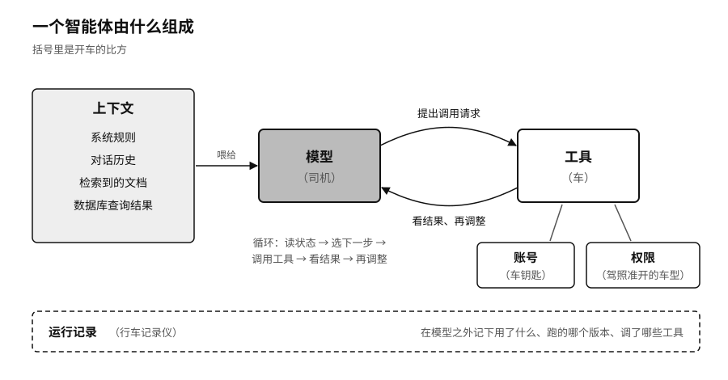

## 智能体架构：上下文、工具与执行

聊天框里的大模型，只会生成一段文字。要让它替人做事，还要给它接上很多东西。

首先是上下文。模型并不知道此刻的用户是谁、库存刚刚变了、哪份制度已经作废，应用程序得把这些信息喂给它：系统规则、对话历史、检索到的文档、数据库的查询结果。上下文让同一个模型可以当客服、当程序员、当研究助理，也让恶意文字有机会混进来冒充命令。二〇二五年披露的 EchoLeak 漏洞就是一个例子：攻击者只要发一封精心构造的邮件，邮件内容就能进入微软 365 Copilot 的上下文，干扰系统分辨哪些是资料、哪些是指令。微软随后修复了漏洞，公开材料没有显示有大规模客户数据泄露。[^p6-echoleak]

然后是工具。应用程序告诉模型有哪些功能可以调用，模型提出调用请求，外部软件决定执行不执行。[^p3-function-calling] 转账的从来不是模型本身，而是支付接口；删除数据的，是拿到了权限的应用。参数有没有校验，工具在不在白名单里，高风险操作要不要人确认，这些都要在模型之外设好。只在提示词里写一句“不许删除”，等于让一句话去当门锁。

最后是循环。智能体会反复地读当前状态、选下一步、调用工具、看结果、再调整计划，一直到任务完成、失败、被取消或者被人接手。[^p3-react]

可以用开车打个比方：模型是司机，工具是车，账号是车钥匙，权限是驾照上准开的车型，运行记录是行车记录仪。同一个司机，只给他一辆只能在停车场里挪动的车，和给他一辆能上高速的车，风险完全不同。

接上这些东西以后，AI 处理的单位也变了。“查一下明天的天气”是一次请求，问一句答一句。“安排下周去北京出差”就是一项任务了：确认日期地点，查日历，比较航班和酒店，守住预算，也许还要等同事回复；中途条件会变，某一步失败了，要决定是重试、换方案，还是回来问人。

自然语言只说出了愿望，很少把边界说全。“把会议安排好”没说能邀请谁、能不能挪动别人已有的日程、能不能给公司外的人发邀请；“帮我订张机票”没说价格上限、退改条件，也没说能不能直接付款。人类同事碰到这些空白，会凭常识去问、去等，或者克制住不做。智能体可能会照着训练中见过的常见做法把空白补上。补对了是方便，补错了，就是没经授权替人做了决定。
