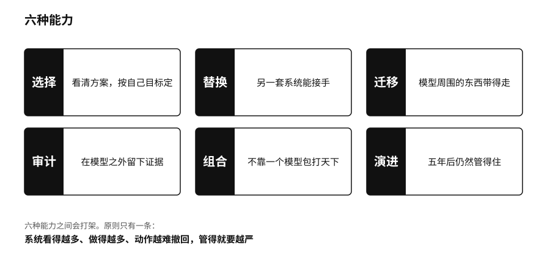

## 六种能力：选择、替换、迁移、审计、组合、演进

主权能不能落地，要看几件具体的事能不能真的做成。我们把它归成六种能力。

选择：能不能看清不同方案的价格、数据条件、限制和风险，按自己的目标来定。十个应用如果背后是同一个模型、同一朵云、同一套计费规则，表面上有十个选项，实际上只有一条路。

替换：条件变了，另一套系统能不能接手。备用方案得真的演练过。替换上来的不必功能完全一样，但关键业务不能归零。

迁移：原始文件通常导得出来，难搬的是模型周围的东西，比如知识库、提示模板、标签、测试题、用户反馈、权限设置、操作记录和团队的工作习惯。欧盟的《通用数据保护条例》规定了个人数据可携带的权利，《数据法》要求云服务商为客户换平台提供便利，“能不能带走”已经从产品体验变成了法律问题。[^p1-gdpr][^p1-data-act]

审计：出了事，不能去问模型“你为什么这么做”，再相信它临时编出来的解释。关键系统要在模型之外留下证据：用了哪些资料，跑的是哪个版本，调了哪些工具，谁批准的，外部世界因此发生了什么变化。

组合：成熟的系统很少靠一个模型包打天下。云端的大模型处理复杂推理，本地的小模型处理敏感资料，普通程序做精确计算，规则守住不能碰的线，人来做撤不回的决定。

演进：今天能用，五年后未必还管得住。模型会更新，接口、芯片和法规都会变。持续保存测试题、记录每个版本的差别、培养能维护系统的人、定期演练迁移，主权才能长期保持下去。

这六种能力之间会打架。审计需要留记录，隐私保护要求少留；开放接口方便迁移，也多了攻击入口；多找几家供应商能减少被锁定，数据也会流到更多地方。没有一张人人满分的表格。原则只有一条：系统看得越多、做得越多、动作越难撤回，管得就要越严。

同一套能力，在个人、部门、企业和国家身上各有不同的样子。以用 AI 筛选简历为例：求职者要知道自己的资料被怎样使用，有机会对结果提出异议；人力部门要决定哪些简历、面试记录和岗位要求可以交给模型；企业要为供应商、测试、歧视风险和最终录用决定负责；政府要划出劳动权利、数据使用和救济渠道的公共边界。这四层谁也替代不了谁。国家建了再多算力，也替个人撤回不了一次授权；个人再小心，也补不上部门之间的数据缺口。
