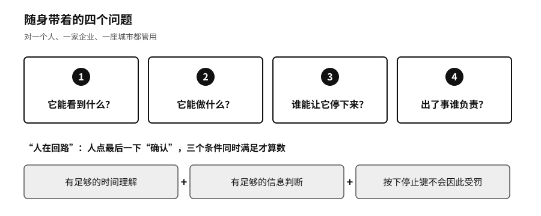

## 随身四问：日常使用的主权检查

六种能力是用来全面体检的。日常用的时候，我们建议记住四个问题：

- 它能看到什么？
- 它能做什么？
- 谁能让它停下来？
- 出了事谁负责？

这四个问题对一个人管用，对一家企业、一座城市也管用。后面几章，从个人到国家，都会回到这四个问题上。

“人在回路”这个说法也要拿这四个问题去检验。让人点最后一下“确认”，不代表决定就是人做的。只有在三个条件同时满足时，人的确认才算数：有足够的时间理解，有足够的信息判断，按下停止键不会因此受罚。

并不是每个人都要训练模型，每家机构都要自建数据中心。我们认为底线可以很朴素，假如你主要依赖的 AI 服务明天停了，至少要做到四件事。核心数据和你积累的东西，能以别处读得懂的格式带走。关键业务有一条演练过的降级路线，慢一点、多用点人，但不会停摆。系统以你的名义做过的重要事情有记录，能停下来，能追责。你的团队里仍然有人懂这件事该怎么做，看得出机器什么时候不该再做下去。

做到这四点，不能保证你永远领先，也谈不上完全独立，但一次外部变化不会让你马上失去继续做事的能力。

这些能力不会因为写进了原则就自动出现。下一部从你自己开始，一层一层看它们怎样建起来。
