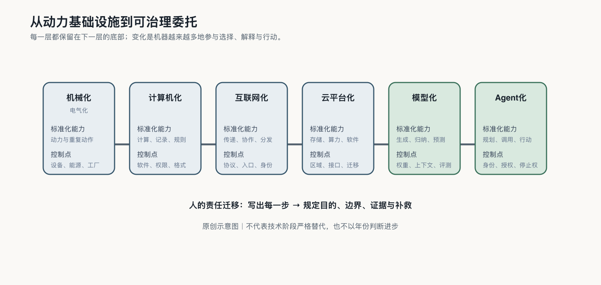

## 从计算工业化到认知与行动工业化

一张电子表格可以在瞬间重算一万行数字，但它不会自己决定应该调哪个单元格。传统软件把人已经说清的规则执行得又快又准；今天的模型则允许人只说目标，再由机器生成内容、补齐步骤，甚至选择下一个工具。

这一次被工业化的不再只是动力、计算或信息，而是判断与行动的编排：机器不只执行路线，也开始参与绘制路线。

人类此前已经经历过好几轮这样的转移。机械化把动力和重复动作交给机器，人保留目标、设计和安全；计算机把规则和计算交给程序，人保留规则定义和异常处理；互联网把信息传递和协作变成即时服务，人保留来源判断和公共规则；云计算把存储、算力和软件变成按需调用，人保留选择供应商和退出的能力。每一轮，机器多做一层，人多管一层——到了智能体阶段，不仅要检查输出，还要管理身份、权限和停止条件。[^p0-infrastructure-history]

人少写了步骤，代价是必须在执行中检查模型如何理解目标、选用资料和采取行动：过去程序出错，工程师找哪条规则写错了；现在还要查上下文、模型版本、工具权限和当时生成的行动路径。

这种改变让过去昂贵的表达、研究和软件能力开始进入小企业、学校、医院和公共部门——连同一种新的不稳定。

截至二〇二六年，斯坦福AI Index记录了一道鲜明的「锯齿边界」：系统能解高难度题，也会在简单感知和长任务中意外失败。AI已足够有用，能够进入生产；它又远未可靠到可以脱离治理。[^p0-ai-world]

这道边界把治理变成生产条件：谁给机器数据和权限，谁检查结果，错误发生后怎样撤回动作、补救损失，都不能留给模型自己回答。AI每向现实多走一步，就多形成一层委托；而这项能力越容易取得，委托关系就会扩散到越多主体。
