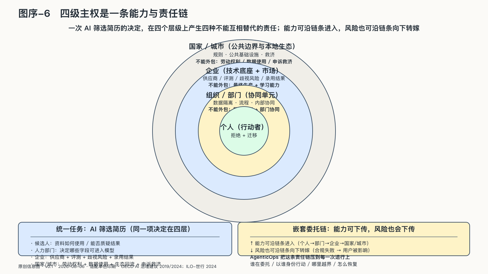

## 四级主权是一条能力与责任链

把AI筛选简历这项常见应用拆开，一个结果会同时追问四个不同的主体。这里不指向某一起具体事件，而是用一条典型任务链看清责任怎样分层：AI主权从来不是单一主体的事。

候选人要知道自己的资料怎样被使用，并有机会质疑结果。人力部门要决定哪些简历、面试记录和职位条件可以进入模型。企业要为供应商、评测、歧视风险和最终录用结果负责。政府则要设定劳动权利、数据使用与救济的公共边界。

同一个决定，在四个尺度上同时产生不能互相替代的责任。

这就是本书所说的四级AI主权——不是把国家主权这个法律概念平均分给个人、部门和公司，而是追问每一尺度上能授权什么，又有什么责任不能外包。四级不是四类主权，而是同一种OPC组织方式沿责任半径持续放大的四个读数：一级是最小的一人公司，二级是它在部门里的重复，三级是它在法人边界上的放大，四级是无数OPC在公共尺度上集聚之后长出的城市与国家。

这四个尺度组成一条嵌套的委托链。个人使用工具，部门组织共同任务，企业提供技术底座并连接市场，政府制定规则、建设基础设施；而政府本身又依赖企业、开源项目和全球供应链。能力可以沿链条进入，风险也会沿链条向其他尺度转嫁。

AgenticOps再把这条责任链落到每一次运行：谁在委托，系统以谁的身份行动，哪里越界，发生了什么，又应该怎样恢复。四级责任只有进入这些具体问题，才能接受现实检验。
