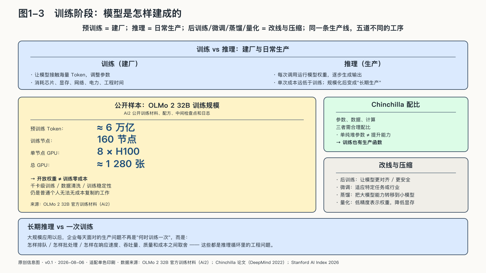

## 训练阶段：模型怎样建成

一次大规模训练结束时，用户还没有收到任何一句回答。巨量计算留下的主要产物，是一组已经调整好的模型权重。训练建立生成能力，推理才在真实请求中使用这项能力。训练是一次性的建厂，推理是日复一日的开工；前者决定能力从哪里来，后者决定它以什么成本、什么价格到达谁手里。这一章的主权问题，大半藏在这两个阶段的差别里。

预训练阶段，系统让模型接触海量Token，反复调整参数，使它更善于预测后续内容。这个过程消耗芯片计算、显存、网络、电力、工程时间和数据治理成本。

模型越大并不必然越好。Chinchilla研究在给定计算预算下比较了数百个模型，显示参数规模、训练数据量和计算投入需要合理配比；一味扩大参数而训练数据不足，可能只是制造一台昂贵却没有得到充分训练的机器。这个结论来自特定实验范围，不是永恒比例，却揭示了：AI训练也有生产函数，设备、数据与算法配方必须协同。[^p1-chinchilla]

训练之后还有多种“改线”方式。后训练让模型更符合人类指令或安全要求；微调让它适应特定任务；蒸馏尝试把较大模型的部分能力转移到较小模型；量化则用更低精度表示权重，以降低存储和运行成本。它们改变的是生产设备或工艺，不等于每次重新建一座工厂。

推理则发生在每一次真实调用中。系统读取输入和上下文，运行模型权重，逐步生成输出。一次调用成本远低于从头训练模型，但它并不接近于零：请求会持续占用加速器、显存、KV Cache、网络、电力和冷却资源。上下文越长、输出越长、推理循环越多，资源消耗通常越高。

大规模应用以后，长期推理更接近企业每天面对的生产问题：怎样排队、批处理，在响应速度、吞吐量、质量和成本之间取舍。

公开项目可以把“建厂”的物理规模摊开。Ai2发布的OLMo 2 32B训练材料显示，模型家族中最大的版本预训练约六万亿Token，使用一百六十个节点、每个节点八张H100，也就是约一千二百八十张GPU；项目还公开训练配方、中间检查点和日志。这个数字不是所有模型训练的统一成本，却提醒：开放权重降低了取得和检查模型的门槛，没有把千卡级训练、数据清洗和训练稳定性变成普通个人可以无成本复制的工作。[^p1-olmo2-scale]

模型进入服务以后，工程重点转向怎样让数以百万计的请求稳定穿过同一套计算系统。
