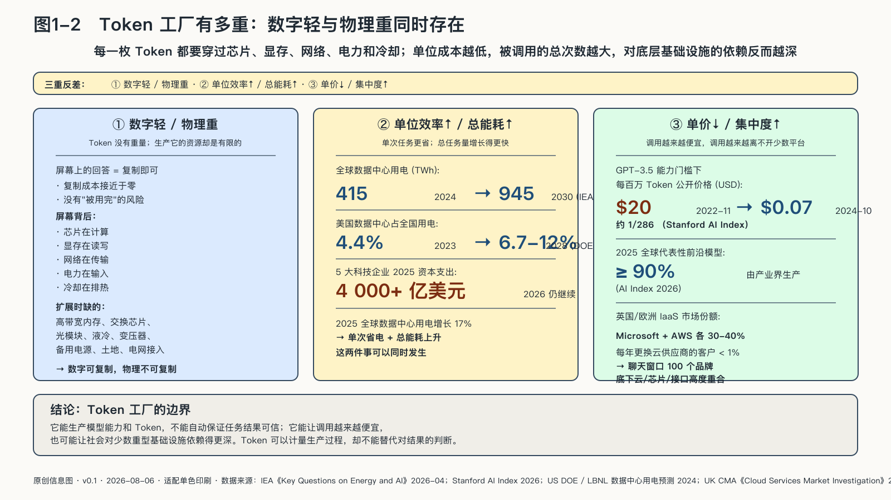

## Token工厂有多重

Token看起来很轻：出现在屏幕上，没有重量，几乎可以瞬间复制；生产Token的工厂却越来越重。轻与重的落差不是修辞，它是这个时代的权力地形：产品越轻，扛在它下面的物理系统就越向少数扛得动的主体集中。

微软在威斯康星州建设的Fairwater把“重”变成了一张工程清单：园区占地约三百一十五英亩，使用约二千六百五十万磅结构钢、一百二十英里中压地下电缆和七十二点六英里机械管线，初始投资承诺三十三亿美元。土地、钢材、电缆和管道不是模型参数，却决定参数能否运转。[^p1-token-factory-builds]

二〇二四年，全球数据中心用电约四百一十五太瓦时；国际能源署预计，到二〇三〇年可能增至约九百四十五太瓦时，AI是增长的重要驱动力之一。单次任务可以越来越省电，长推理或多步智能体任务却远比一次短问答消耗更多——单位效率提高和总用电上升可以同时发生。[^p1-iea-energy]

每一枚Token背后都有芯片计算、显存读写、电力输入、冷却排热。需求扩大后，问题不再只是“有没有GPU”，还包括高带宽内存、交换芯片、光模块、液冷设备、变压器、备用电源、土地和电网接入能否按时到位。

资金流向把这套重量显现出来。微软二〇二五财年计划投入约八百亿美元建设数据中心，超过一半投向美国；二〇二五年五家大型科技企业的资本支出合计超过四千亿美元；全球数据中心用电二〇二五年增长百分之十七，AI数据中心增长更快。[^p1-token-factory-builds][^p1-iea-ai]

英伟达把AI产业描述成一个“五层蛋糕”：能源、芯片与计算基础设施、云数据中心、模型和应用，自下而上；摩根大通预计二〇二六年全球AI相关资本开支接近八千七百亿美元，高盛估计到二〇二六年底全球AI投资超过一万亿美元，两组数字口径不同，却指向同一个方向——谁在这一轮建设中占住底层，谁就在给未来十年的上层收租。工厂一旦建成，依赖结构会比任何一份合同都更持久。[^p7-five-layer-cake]

二〇二六年八月十七日，黄仁勋在X上发表长文《保卫智能的基础设施》，把这套逻辑再推一步：对前沿实验室来说，约束增长的已不再是算法，甚至不再是芯片，而是土地、电力和厂房——他称之为LPS。云厂商有能力自己签下几十年的场地与电力长约，前沿实验室的资产负债表却撑不起；于是英伟达亲自下场，像过去锁定芯片产能那样为AI工厂锁定LPS。第一个落子在俄亥俄州的PORTS-Pike园区：英伟达与SB Energy合作锁定场地，OpenAI作为租户进驻，初始规模四点二五吉瓦；按英伟达测算，每一代部署约相当于一百五十万张GPU、一千五百亿至两千亿美元收入。这笔结构里最值得记下的，是英伟达为租约和电费中的约定部分以及残值作了担保。面对“循环融资”的追问，黄仁勋称租金由OpenAI支付，英伟达只是用规模和订单可见性锁住稀缺场地；是否成立，要由投产进度和付款记录检验。但无论结论如何，信号已发出：芯片厂商的担保开始进入土地和电力合同，依赖沉到了物理层的最底部。[^p1-nvidia-lps-2026]

在美国，能源部与劳伦斯伯克利国家实验室估计，数据中心二〇二三年已占全国用电约百分之四点四，到二〇二八年可能升至百分之六点七至十二；预测区间很宽，却足以说明AI扩张已成为电力与基础设施规划必须面对的变量。[^p1-infra-2026]

但在用户一侧，Token又确实变便宜了。

Stanford AI Index统计，达到相当于GPT-3.5能力水平的系统，每百万Token的公开推理价格从二〇二二年十一月约二十美元降到二〇二四年十月约七美分，只剩原来的约二百八十六分之一。这个数字比较的是特定能力门槛下的公开价格，不等于购电、芯片和数据中心的实际成本，但下降趋势非常清楚。[^p1-inference-cost]

“工厂更重”和“产品更便宜”并不矛盾：芯片、模型和推理系统的进步压低了单次调用价格，价格下降又让更多人和业务流程开始调用模型——一次调用更省，调用总量却更大。电力和通信都经历过类似变化：单位服务越来越便宜，社会反而更离不开背后的网络。

能力扩散的同时，生产控制仍可能集中：产业界生产了二〇二五年全球超过九成的代表性前沿模型；英国竞争与市场管理局的调查还显示，在英国的基础设施即服务市场，Microsoft与AWS二〇二四年各占约百分之三十至四十，每年真正更换云服务商的客户不足百分之一。门槛、规模经济、数据迁出成本和技能不易平移，会把客户留在少数底层平台上。[^p1-ai-index-2026][^p1-cma-cloud]

这条路也有清晰的走偏方式。一种是把“工厂越来越重”读成“越重越好”：各地都要建自己的智算中心，报表上每秒Token数节节攀升，真实订单却喂不饱设备，重资产最后变成沉没成本。另一种走偏发生在计量上：把Token产量当成产值，工厂日夜开工，生成的文字却要专家从头重做——产量是真的，价值是假的。基础设施竞赛比的从来不是谁的烟囱多，而是谁的工厂里有真实任务在流动。

到这里，本章回答了序章留下的问题：智能的权力以Token的形式被生产出来——在一座比想象中重得多的工厂里，按单位计量，按账单分配。但新的问题等在门外：能力被生产出来之后，怎样到达普通人和普通组织手里？蒸馏、量化、开放权重、本地部署，每条出厂路径都改变能力与控制权的分配——这是下一章要回答的。
