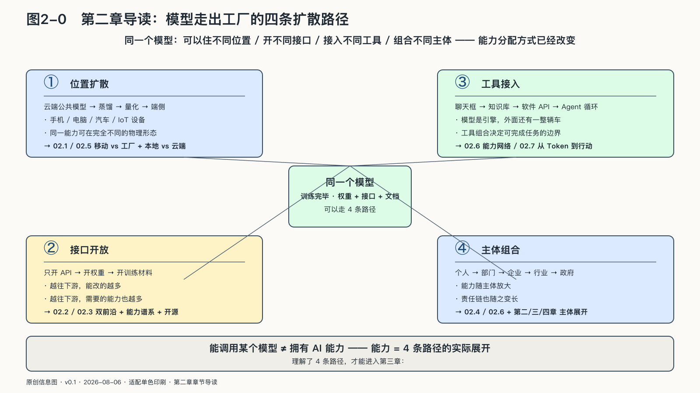

# 第二章　模型走出工厂：能力怎样扩散与组合

第一章结束时，Token工厂已经像电网一样运转起来：能力被集中生产，Token像电力一样流出。但电力进入千家万户，靠的不是发电厂，而是输电网、变压器和插座。能力出厂之后怎样到达普通人和普通组织手里？这一章接过这个问题。

本章从一个判断开始：开放权重加上不断下降的部署成本，正让模型能力以前所未有的速度扩散与组合，扩散本身已改变竞争的底层结构。领先难以固定，榜单上的差距以月为单位缩小或换位；门槛持续下降，昨天需要前沿实验室展示的能力，今天可以蒸馏进手机里的三十亿参数；胜负的落点也从“谁训练出最强的模型”，移向“谁能让能力进入更多真实任务、留在更多开发者手里”。

模型工厂交付的核心产物只是一组权重：它不认识你的客户，不知道今天的库存，也无权把任何一句话发送给真实世界。离开数据、工具和人的授权，再强的模型也只能停在能力的起点。

权重走出工厂后，可以留在云端，也可以经过蒸馏和量化进入手机；可以只开放一个调用接口，也可以把权重、代码和训练材料一并公开；可以停在聊天框里，也可以接入知识库、软件工具和智能体循环。改变的不只是部署位置：压缩、分配和连接的方式，决定了谁能取得它、修改它，并把它用到自己的任务里。

本章沿四条线追踪这段旅程。先看领先为什么难以固定，蒸馏和论文怎样让能力跨过公司边界；再看模型为什么同时变大又变小，能力怎样沿一条可追溯的谱系从万亿参数流到端侧；接着看开源究竟打开哪一道门，本地与云端怎样组合成一条生产线；最后看模型接进数据、工具、身份和协议之后，能力如何变成会行动的网络。

到那时，“能调用某个模型”与“手里真正有一套AI能力”的距离才看得清，一个更尖锐的问题也跟着浮出来：当能力人人可得，控制权和选择权还剩什么？
