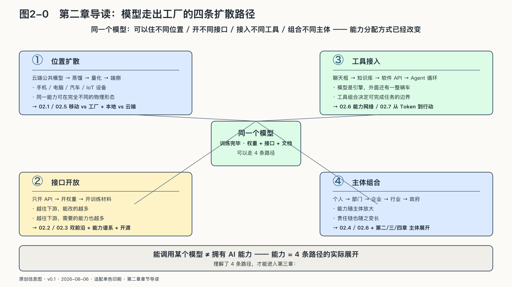

# 第二章　模型走出工厂：能力怎样扩散与组合

能力在工厂里被生产出来，还要送到普通人手里——电力靠输电网、变压器和插座，模型靠蒸馏、量化、开放权重和部署。

权重出厂时只是一组数字：它不认识你的客户，不知道今天的库存，也无权把任何一句话发送给真实世界。离开数据、工具和人的授权，再强的模型也只能停在能力的起点。它可以留在云端，也可以经蒸馏和量化进入手机；可以只开放一个调用接口，也可以把权重、代码和训练材料一并公开；可以停在聊天框里，也可以接入知识库、软件工具和智能体循环。压缩和连接的方式，决定了谁能取得它、修改它，并把它用到自己的任务里。

这一章沿四条线追踪这段旅程：领先为什么难以固定，能力怎样沿一条可追溯的谱系从万亿参数流到端侧，开源究竟打开哪一道门，本地与云端怎样组合成一条生产线，模型接进数据、工具、身份和协议之后，能力如何变成会行动的网络。

改变的不只是部署位置。当能力人人可得，「能调用某个模型」与「手里真正有一套AI能力」的距离才看得清——一个更尖锐的问题跟着浮出来：控制权和选择权还剩什么？这是第三章要回答的。
