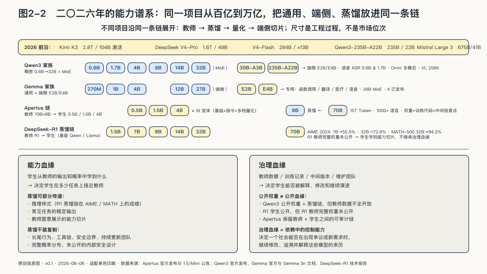

## 一条可追溯的能力谱系

要看清一项能力最终留在谁手里，只看某一天的榜单是不够的——榜单记录时点，谱系记录去向：一项能力怎样被发现、压缩、改造，最后部署到谁的设备上。后者才是能力真正流动的方式。

瑞士的Apertus项目把这两条前沿放进了同一个工程过程。

二〇二五年九月，苏黎世联邦理工学院、洛桑联邦理工学院与瑞士国家超级计算中心发布了八十亿和七百亿参数的Apertus模型。训练在该中心的Alps超级计算机上完成，使用约十五万亿Token，覆盖一千多种语言，其中约百分之四十不是英语；项目同时开放模型权重、训练与评测代码、数据准备过程和中间检查点，而不只提供一个聊天入口。[^p2-apertus]

这些事实不能证明Apertus在所有任务上领先，也不能证明开放模型天然更可靠；它们回答的是另一类问题：研究者想检查训练过程，大学想为本国语言继续训练，机构想固定版本并在自己的环境中部署——他们能否获得足够材料开始工作？

八个月后，这条谱系继续向小模型延伸。二〇二六年六月，项目团队从八十亿参数的教师模型出发，发布了五亿、十五亿和四十亿参数版本，共十六个模型。团队没有只让学生模仿教师最后说出的文字，而是保存教师预测下一个Token时的概率信息，让学生学习这些更丰富的信号。项目材料称，这一训练过程所需计算量最高可比从头预训练低约一个数量级——这是作者在特定条件下的结果，不是蒸馏项目的普遍定律。[^p2-apertus-mini]

这段过程把“模型越来越大”和“模型越来越小”从一句趋势判断变成了可观察的生产关系：八十亿和七百亿参数模型承担较完整的通用能力与教师角色，较小模型把部分能力带到内存和计算受限的设备，量化版本继续降低部署门槛。它们处在同一条从发现、训练、压缩到部署的链上。

到二〇二六年，类似谱系已经不只存在于Apertus：Qwen3把零点六B到二千三百五十亿总参数放在同一产品家族中，Gemma把通用、端侧和函数调用等形态分开，DeepSeek V4把超大Pro模型与更低激活的Flash模型并列提供。它们展示了相近的生产组织——前沿模型扩大专家容量和上下文，较小模型承接语音、分类、工具调用或端侧任务。[^p2-small-model-family-2026]

这条链还可以从蒸馏的“能力切片”看得更清楚：在作者报告的AIME 2024测试中，七十亿参数的Distill-Qwen达到百分之五十五点五，三百二十亿参数版本达到百分之七十二点六，MATH-500上达到百分之九十四点三。它说明推理样式可以沿公开样本扩散，却不说明学生取得了教师的全部权重、训练数据、工具链和安全边界。[^p2-distillation]

追踪这条链时，还要区分两种血缘。

第一种是**能力血缘**：小模型从教师的输出和概率中学到了什么，它决定学生在多少任务上接近教师。

第二种是**治理血缘**：教师使用了什么数据和许可，训练过程怎样记录，谁能检查中间版本，学生经过哪些蒸馏与量化步骤，后续由谁维护——它决定使用者能否解释模型从哪里来，并在出现争议、缺陷或新需求时继续修改。

蒸馏可以传递第一种血缘的一部分，却不能自动带来第二种：一个团队可以利用封闭教师的文字输出训练学生，却未必获得教师的数据来源、完整概率、内部安全设计和长期更新能力。Apertus保留了教师、训练材料、压缩方法和小模型版本之间相对连续的可审计谱系。

Alps超级计算机仍由全球芯片、网络、软件与研究共同体构成，瑞士没有因此实现技术自给自足；公共机构增加的是另一组能力——决定算力用于什么、哪些训练材料公开、哪些语言被纳入、模型怎样进入研究与产业、后续版本能否继续演进。这个案例体现的是依赖中的控制能力。

二〇二六年七月，Apertus 1.5继续发布，项目把目标明确为可持续更新的开放基础设施，而不是在商业前沿榜单上取得一次冠军。这个目标能否实现，仍需用模型质量、维护持续性、真实采用、安全响应和公共投入效率检验；公开承诺不是结果本身，却让外部拥有了检验结果所需的对象。[^p2-apertus-mini]
