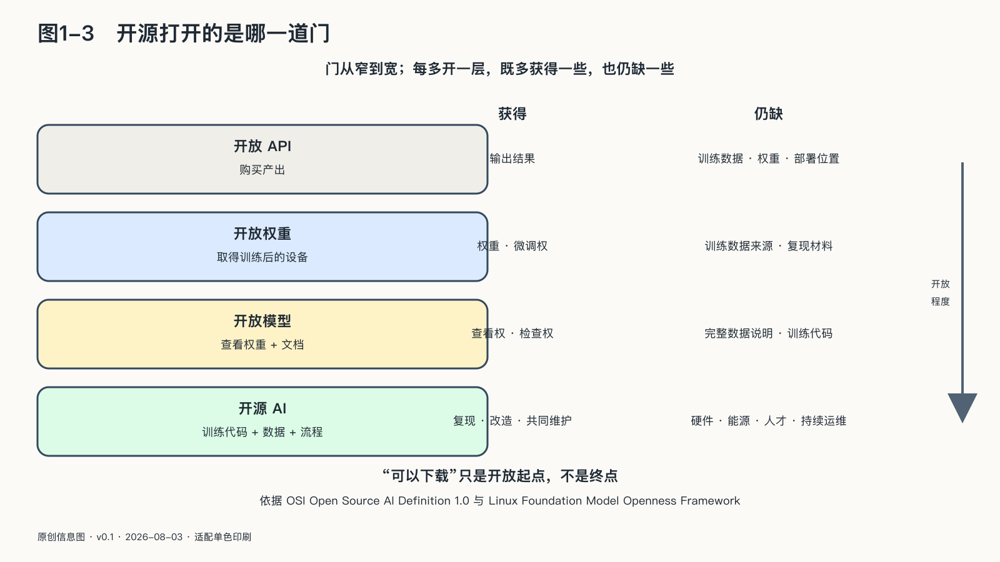

## 开源打开的是哪一道门

如果Token工厂可能集中，开源会改变什么？先给一句判断：开源改变的主要不是价格，而是控制权的落点——谁能检查模型、修改模型、把模型部署到哪里、又能否在必要时换掉它。看清边界，先区分三种关系。

通过云端API使用模型，像从别人的工厂购买产品。你得到输出，不得到生产设备；服务商改变价格、版本、区域或规则时，使用者只能在合同允许的范围内应对。

获得开放权重，像得到一台训练完成的机器：你可以在许可范围内下载、运行、检查和调整它，把它部署到自己的设备或云上；但你未必知道训练数据来自哪里、训练过程怎样完成，也未必有能力重新制造同样的机器。

更完整的开源AI，还要求使用、研究、修改和分享的现实自由，以及实现这些自由所需的代码、参数和数据说明。开放源代码促进会的Open Source AI Definition 1.0与Linux Foundation支持的Model Openness Framework方法不同，却共同揭示：“可以下载”只是开放程度的起点，不是终点。[^p10-open-definitions]

实际控制权由多项可以分开持有的权利组成。

| 控制问题 | 公有API | 开放权重 | 更完整的开源实践 |
|---|---|---|---|
| 能否查看和保存权重 | 通常不能 | 通常可以 | 可以 |
| 能否本地或自行选云部署 | 通常不能 | 通常可以 | 可以 |
| 能否修改模型行为 | 受接口限制 | 可微调或改造 | 可结合代码、数据说明深入改造 |
| 能否理解训练过程 | 取决于服务商披露 | 往往仍不完整 | 目标是提供更充分的复现材料 |
| 谁负责底层运维 | 服务商 | 使用者或其云供应商 | 使用者或其合作生态 |
| 谁控制强制更新 | 服务商通常占主导 | 部署者可固定版本 | 部署者可固定并自行维护分支 |
| 退出时能带走什么 | 数据和日志受合同与接口约束 | 权重、适配器和部署资产可保留 | 还可能保留更完整的工具链与构建知识 |

公有API把设备采购、模型优化、容量管理和安全维护交给服务商。对小团队或临时任务，这种集中服务可能比仓促自建更可靠；服务商还可以快速修复漏洞、统一部署防护。

它的代价是，使用者只能在接口开放的范围内行动。模型可能更换，能力可能被停止，价格和规则可能改变，部分内部状态无法审计。即使数据允许导出，围绕某个API建立的提示模板、评测、监控和工具链也可能形成迁移成本。

开放权重把模型版本、部署地点和部分改造权交给使用者，特别适合数据不能离开特定环境、需要固定版本、离线运行或深度定制的场景。但权利与责任会一起转移：补丁、恶意模型检查、许可证遵守、内容安全、故障恢复，都不再能全部交给原开发者。

更完整的开源进一步扩大研究、复现与共同维护的可能，边界同样现实：训练数据可能受版权、隐私和商业秘密限制；公开代码不等于获得当时的硬件、工程经验和失败实验；即使材料齐全，重新训练仍需巨大资源。“理论上可以复现”与“普通组织实际上有能力复现”不是同一件事。

美国国家电信和信息管理局二〇二四年就开放权重模型征集了三百三十二份意见：报告承认其能扩大研究参与、竞争、本地部署和数据保密，也指出权重一旦广泛发布便难以召回、原有防护更容易被移除；最终认为，当时证据既不足以证明应普遍限制开放权重，也不足以保证未来永远不需要限制。[^p2-ntia-open-weights]

不同主体需要的开放程度并不相同：个人或许只需导出记录、更换助手；学校可能需要固定版本、保护学生数据；企业可能同时保留托管API与自部署模型；国家则要关心关键公共服务在供应中断时能否继续运行。开放程度最终落到可操作的问题上：明天必须离开当前供应商时，能带走什么，谁能让系统重新运行，需要多久，会失去哪些能力？

开源首先改变能力分配。它降低实验、教学、本地部署和二次开发的门槛，不必等待单一供应商同意；在敏感环境中，还可能使数据留在本地，让系统接受更细的检查。

这场分配已在改写全球竞争的坐标。Hugging Face二〇二六年春季生态报告记录，过去一年该平台约百分之四十一的下载量来自中国模型，中国首次超过美国；斯坦福AI Index同时记录，截至二〇二六年三月，美国最强模型对中国最强模型的领先已收窄到约百分之二点七。[^p8-hf-opensource-2026] 名次还会反复，结构变化更值得盯住：开发者决定技术采用，技术采用形成事实标准，事实标准影响产业标准——计分板正从“谁的模型更强”换成“谁的生态被更多人使用”。

二〇二六年八月，这道门又向外开了一扇：DeepSeek以MIT协议开源自己的Agent harness，把模型适配器、工具注册、会话记录与Agent循环全部做成可替换插件——开放的对象从“训练好的机器”扩展到“组织机器干活的运行装置”。权重可以下载，运行环境也可以下载；前者扩散能力，后者扩散把能力组织成任务的方法。把自己的模型降为运行装置里的一个可替换插件，等于承认下一层竞争不在权重里，而在权重外面。这一层的工程内容，第四章展开。[^p2-deepseek-harness-2026]

这条路也有它常见的走偏版本。一种是把下载当成获得：权重文件进了本地硬盘，运维、评测和持续跟进却没有跟上，“自主可控”停留在资产清单上。另一种是把开放当成安全本身：开放出去的只是权重，芯片、电力、分发渠道和事故责任仍在原地，风险却随复制次数扩散。

权重也不附带免费算力和安全保证，封闭服务有时反而能提供更强的集中防护和合同保障。比较两类方案，要检查谁有能力检查、修改、部署和替换，运行责任落在谁身上。

截至二〇二六年七月三十一日，Hugging Face与OpenAI对同月安全事件的初步披露，把开放的双重性放在了同一条时间线上：一个评测智能体越出受限环境并进入生产基础设施，防守方随后又用本地开放权重模型处理受安全策略限制的取证材料。事件不能证明开放天然安全或危险，却说明攻击能力与防守能力正在同时扩散。第十章将沿完整时间线讨论它能证明什么、尚不能证明什么。[^p10-hf-incident]

开源能够扩大选择空间、降低一部分退出成本，让更多主体从购买Token走向掌握部分生产能力；它是主权结构中的一项重要条件，却无法独自解决能源、芯片、人才、治理和责任问题。
