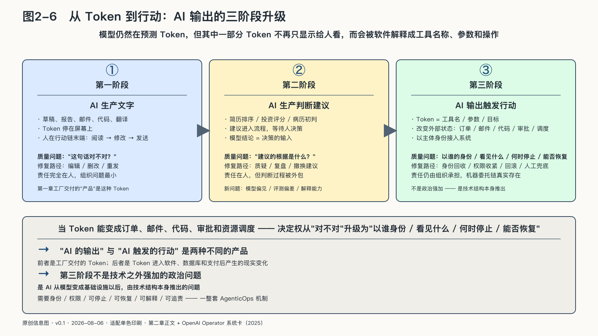

## 当输出越过屏幕

一枚输出Token出现在屏幕上，可以只是一个字。同一枚Token被软件解释成工具名称、参数和操作指令，就可能查询数据库、发出邮件、提交代码，或向支付系统发起请求。

模型的底层机制仍然是预测Token，生产线的最终产品却已经从文字、判断建议，进一步变成可以改变外部状态的动作。

当Token变成订单、邮件、代码、审批和资源调度，质量问题就不再只是“这句话对不对”。新的问题是：它以谁的身份行动，看见了什么，得到了什么权限，犯错后能否停止和恢复。

控制的焦点因此从“答案是否正确”，扩大到“谁授权它行动”。

到这里，本章的问题有了答案：能力确实走出了工厂。它被蒸馏和量化压进更小的模型，被开放权重分发到任何愿意下载的人手里，被部署到本地与云端的任意组合，又被数据、工具、身份和协议接成会行动的网络。“能不能得到AI能力”，正在变成一个不难的问题。

但能力人人可得之后，更难的问题浮了上来。当所有人都能调用、下载、组合同一批能力，你和别人之间的差别还剩什么？当模型替你读写、决策、行动，控制权握在谁手里，选择权还剩多少，退出和问责的门又在哪里？回答这些问题，需要一个比“使用”更重的词。这是第三章要回答的。
