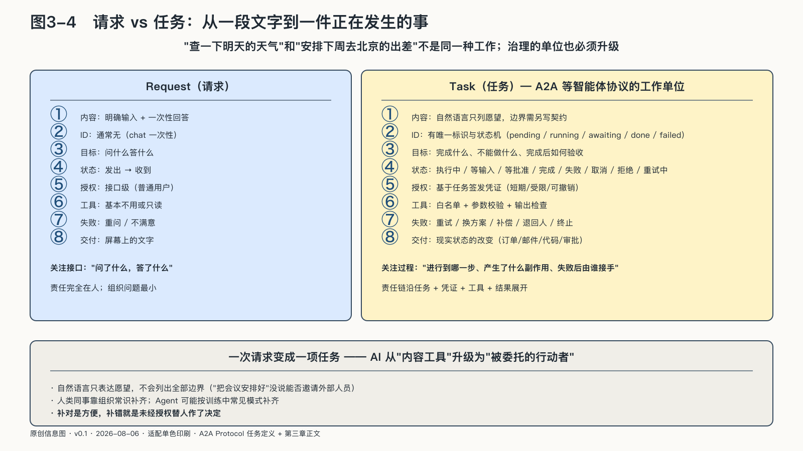

## 一次请求正在变成一项任务

“查一下明天的天气”与“安排下周去北京的出差”不是同一种工作。

前一句接近请求：有明确输入和一次性回答。后一句是一项任务：确认日期地点，检查日历，比较交通和酒店，遵守预算，可能还要等同事回复；条件会变化，某一步失败后还要决定重试、换方案，还是回到人这里。

一次请求答错，损失的是一段文字；一项任务做错，损失的是真实世界里的状态。

A2A等智能体协议把Task定义为有唯一标识、状态和生命周期的工作单位：执行中、等待输入、等待授权、完成、失败、取消或拒绝，可持续较长时间并产生交付物。协议不能自动提供企业授权或结果可信，却显示工程世界已从“返回一段文字”转向“管理一件正在发生的事”。[^p3-a2a-task]

自然语言只表达愿望，不会列出全部边界。“把会议安排好”没有说明可以邀请谁、能否移动已有日程、能否向外部人员发信；“帮我买一张机票”没有说明价格上限、退改条件和付款权。

人类同事遇到这些空白，会凭组织常识询问、等待或克制。Agent可能按训练中的常见模式补齐。补得对，是方便；补得错，就是未经授权替人作了决定。

所以，需要治理的基本单位不再是一句Prompt或一个模型，而是一项带着目标、状态、授权、预算、结果和失败路径的任务。
