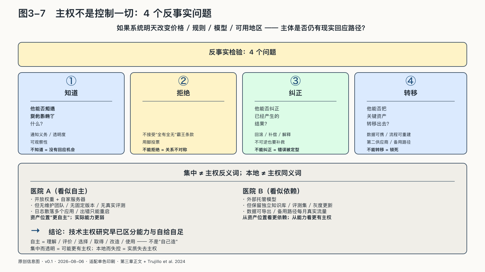

## 主权怎样容纳委托与合作

把主权理解为“凡事亲自完成”，会得到一个既不现实也不自由的结论。委托可以增加自由，条件是它不能取消重新选择的权力。

视力障碍者借助AI读取屏幕，一人公司把排期、翻译和资料整理交给智能体，都可能比过去拥有更多真实选择。依赖增加了，行动自由也增加了；只计算“多少工作由机器完成”，就会把帮助误判为失权。

导航可以替人计算路线，却不应悄悄改变目的地；医疗模型可以帮助医生发现线索，却不能让机构用一句“系统建议如此”取消专业判断。好的委托减少完成任务的负担，不夺走重新确定任务的权力。

可以用一个反事实检验：如果系统明天改变价格、规则、模型或可用地区，主体是否仍有现实的回应路径——知道变化影响了什么、拒绝新条件、纠正已产生的结果、转移关键资产、让另一种安排接手？答案若长期是否定的，便利就可能变成支配。

“支配”并不等于对方已经作恶。平台即使从不滥用权力，只要它能任意改变关键条件，而使用者没有有效退出、发声或救济，不对称已经存在；反之，清楚接口、可携带资产、稳定承诺、独立监督和真实替代，可以把这种任意性压低。

设想两家医院。第一家把开放权重模型放在自己的服务器上，却没有维护团队、固定版本和真实评测，日志散落，出错后只能重启。第二家使用外部托管模型，但保留独立知识库和评测集，高影响动作经过本院权限系统，供应商更新必须灰度验证，数据与工作流能够导出，备用路线每月承担少量真实流量。

从资产位置看，第一家“更自主”；从实际能力看，第二家可能更有主权。开放模型给了第一家修改和运行的权利，却无人把权利转化为能力；外部服务让第二家形成依赖，却没有垄断它的判断、证据和退出。

技术来源也不是无关变量：法律管辖、供应路径、安全更新和出口限制都会影响风险，应进入依赖图，却不能替代控制分析——来自本地并不充分，来自外部也不必然失去主权。

技术主权研究中的重要区分正是：主权是一种理解、评价、选择、获取、改造和使用关键技术的能力，而不是把每一个部件都关在边界之内。[^p3-tech-sovereignty]

这条路最容易走偏成两种样子。数字洁癖把任何外部依赖都视为失权，要求每个部件都出自本地，结果成本失控、版本落后，主权还没建成，能力先被拖垮；关门主义以主权为名取消比较和替换，把一家供应商、一条技术路线写死成唯一答案，主权沦为锁定的别名。两种走偏共享同一个错误：把主权当成资产的产地标签，而不是能力的可检验状态。

AI主权不先宣布哪一种架构正确，再寻找例子；它要求本地与云端、开放与封闭、单一与多供应商接受同一组比较：谁能决定，谁能验证，谁能停止，谁能恢复。
