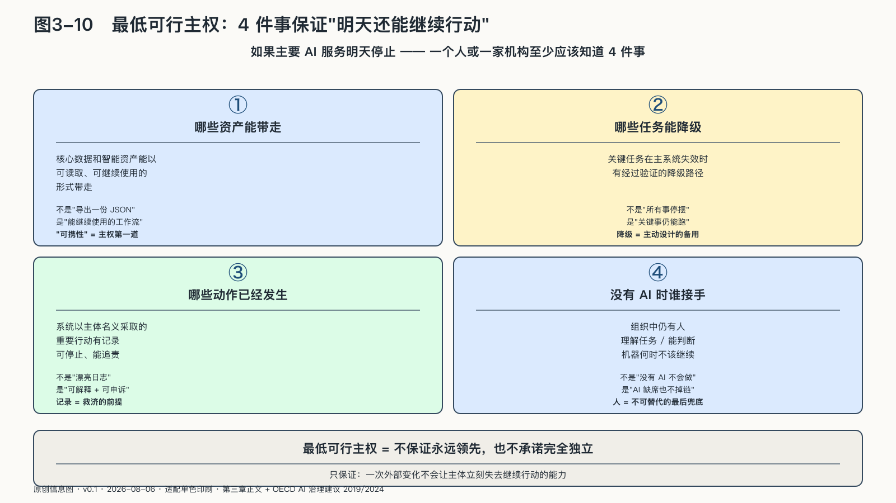

## 最低可行主权

如果主要AI服务明天停止，一个人或一家机构至少应该知道四件事：哪些资产能带走，哪些任务能降级，哪些动作已经发生，以及谁能在没有AI的情况下接手。

并非每个人都要训练模型，每家机构也不必自建数据中心；底线可以很朴素：

核心数据和智能资产能够以可读取、可继续使用的形式带走。

关键任务在主要系统失效时有经过验证的降级路径。

系统以主体名义采取的重要行动有记录、可停止、能追责。

组织中仍有人理解任务，能够判断机器何时不该继续。

最低可行主权不保证永远领先，也不承诺完全独立，只保证一次外部变化不会让主体立刻失去继续行动的能力。

AI主权由此不再是一个盖在技术之上的大词。当Token只组成句子时，我们需要核验；当Token进入上下文时，我们需要边界；当Token调用工具并形成循环时，我们需要权限、状态、停止和责任。

本章到此把主权从口号拆成了可以检验的能力：理解、选择、替换、问责。这些能力不会从原则里自动长出来——边界怎样写进任务契约，身份怎样跟着行动走，失败怎样被停止和修复，经验怎样回流成下一次可用的资产？主权要从理念变成每天的运行，需要一套覆盖交付、运行、学习与退出的工程方法。这是下一章要回答的。
