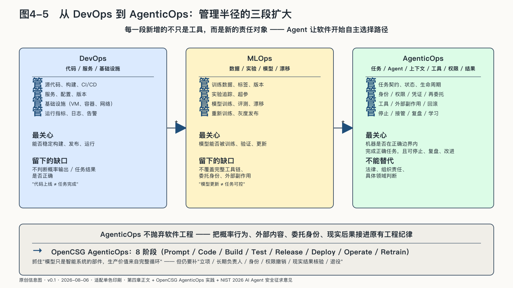

## 从DevOps到AgenticOps

软件进入大规模生产以后，写完代码不再是结束。DevOps把开发、测试、发布和运行连接起来，让变化频繁发生，又不至于每次都把系统推倒重来。

机器学习进入生产后，代码之外又多了数据与模型。MLOps管理训练数据、实验、模型版本、部署和漂移——即使程序没变，数据分布变化也可能让模型失效。

智能体再向前一步：模型不再只是返回预测，而是围绕目标选择步骤、读取资料、调用工具、使用身份和权限、维持任务状态并改变现实；系统行为由模型、提示、知识、记忆、工具、权限、运行环境与人工判断共同产生，任何一项变化都可能改变结果。

三段扩大背后是同一条线：机器离现实行动每近一步，“系统能稳定发布”就离“系统可以被负责”更远一步。

| 方法 | 主要管理对象 | 最关心的问题 | 单独使用时留下的缺口 |
|---|---|---|---|
| DevOps | 代码、服务、基础设施 | 能否稳定构建、发布和运行 | 不判断概率输出与任务结果是否正确 |
| MLOps | 数据、实验、模型、漂移 | 模型能否被训练、验证和更新 | 通常不覆盖完整工具链、委托身份与外部副作用 |
| AgenticOps | 任务、Agent、模型、上下文、工具、权限与结果 | 机器是否在正确边界内完成了正确任务，并且可以停止、复盘和改进 | 仍需法律、组织责任与具体领域判断共同约束 |

二〇二三年，OpenCSG把其在模型迭代、反馈数据和智能体更新中的实践系统化为AgenticOps，提出Prompt、Code、Build、Test、Release、Deploy、Operate、Retrain八个相连阶段，并强调系统优先、运行数据、自动化与人的治理。它抓住了一个关键变化：模型只是智能系统中的部件，生产价值来自完整循环，而不是一次API调用。[^p4-agenticops-origin]

但八阶段仍沿软件交付流水线观察问题；进入真实业务，还必须补上不能靠“持续迭代”代替的责任：是否应该立项，谁是长期负责人，以谁的身份行动，权限怎样撤销，结果如何核验，事故怎样制动，系统何时退役。

此后，产业与研究界更多使用AgentOps，含义从追踪可观测性到治理、安全与完整生命周期不等，名称尚未统一。[^p4-agentops-landscape] 本书保留AgenticOps，强调它管理的是整个“agentic system”——能够自主选择路径并产生行动的系统。

NIST在二〇二六年汇总AI Agent安全征求意见时记录了一项广泛共识：传统网络安全原则仍然有效，但要适配模型输出与软件行动结合以后出现的新问题；安全疑虑本身已经成为采用障碍。[^p4-agent-security-2026] AgenticOps处理的正是这个接缝，把概率行为、外部内容、委托身份和现实后果接进原有工程纪律。

本章讨论范围不限于OpenCSG的产品架构；其产品能力与运营数字均为企业自述口径。本书只取这个方法起点，并用NIST文件、开放协议、运行遥测、评测研究和不同厂商实践，检验这套方法能否跨技术栈成立。

本书所说的AgenticOps是：

> **AgenticOps，是让会行动的AI在完整生命周期中保持任务有界、身份可认、行动可控、过程可见、结果可验、失败可收拾、经验可积累的方法。**
