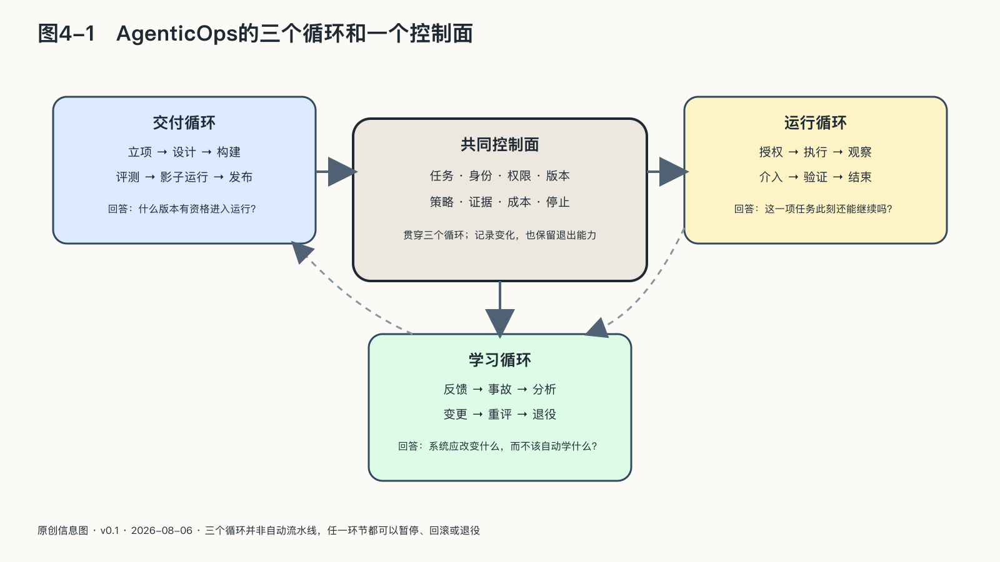

## 三个循环和一个控制面

把AgenticOps画成一条从左到右的流水线，很容易误以为系统上线以后只需收集数据、重新训练，再发布下一版。流水线思维管得住代码的交付，管不住一个边做边选择的系统——真实运行更像三个相互咬合的循环，任何一个停转，另外两个都会把缺陷越转越大。

第一个是**交付循环**：准入、设计、构建、评测、发布，决定什么任务值得使用Agent，失败边界怎样写入设计，模型、提示、知识、工具和权限怎样形成一个可识别版本，以及什么证据足以上线。

第二个是**运行循环**：授权、执行、观察、干预、验证结果，发生在每一项真实任务中：谁发起、Agent代表谁、这一状态需要什么权限、外部动作是否成功、何时必须停下来问人。

第三个是**学习循环**：反馈、事故、分析、变更、重新评测或退役。真实失败可以变成回归测试，人工修改可以暴露规则空白，投诉可以揭示评测没有覆盖的人群；学习不等于把所有对话送去训练，它也可能要求改知识、修接口、缩权限，或者承认这项任务不适合智能体。

三个循环共同依赖一个**控制面**，保存稳定关系：任务与责任人，Agent与身份，工具与权限，组件与版本，测试与发布门，轨迹与外部结果，成本与预算，事故与退出路径。

控制面不是另一款大模型，也不必由单一平台包办，可以由身份系统、工作流、模型网关、资产仓库、评测服务、运行遥测、审批和人工制度组合实现。关键不在界面是否统一，而在一项任务的信息能否从立项一直连接到结果与补救。

### 框架下面，是一组方法

AgenticOps给出的是完整生命周期和责任框架，工程团队每天使用的却是一组颗粒度更小的方法。混为一谈会产生一种常见误会：仿佛选了某个Agent框架，智能体怎样工作、验证和长期运行的问题就都解决了。

二〇二五至二〇二六年，智能体工程中逐渐形成了六类相互衔接的方法：

| 方法 | 直接改造什么 | 典型动作 | 它不等于什么 |
|---|---|---|---|
| 提示工程 | 单次或局部推理的指令 | 明确角色、约束、示例和输出格式 | 不等于管理完整上下文 |
| 上下文工程 | 每一步推理时模型实际看见的信息 | 按需检索、压缩历史、维护工作记忆、选择工具说明 | 不等于把全部资料塞进窗口 |
| 工具与技能工程 | Agent能够理解和调用的行动接口 | 缩小工具边界、校验参数、写清返回语义、封装可复用步骤 | 不等于接上API就完成集成 |
| Harness工程 | 模型外侧持续推动任务的运行装置 | 设计循环、计划、工具路由、状态、检查点、恢复、批准与沙箱 | 不等于购买一个开发框架 |
| 评测驱动开发 | 能力与变化的验收方式 | 先定义任务和评分器，多次试验，检查轨迹与外部结果，建立回归集 | 不等于只看最终回答或榜单 |
| 轨迹驱动优化 | 已发生任务留下的过程证据 | 从失败轨迹选案例、重放、比较候选改动，再更新提示、工具或harness | 不等于把所有日志直接拿去训练 |

边界在这里很重要。RAG、记忆和压缩是上下文工程的具体机制；MCP是连接工具与资源的协议；多Agent是任务分解与协作模式；沙箱、最小权限和人工批准是安全控制；可观测性负责留下过程证据——都很重要，却不应各自被包装成解释一切的新总框架。[^p4-agent-engineering-methods-2026]

六类方法中，harness工程值得单列一节。
