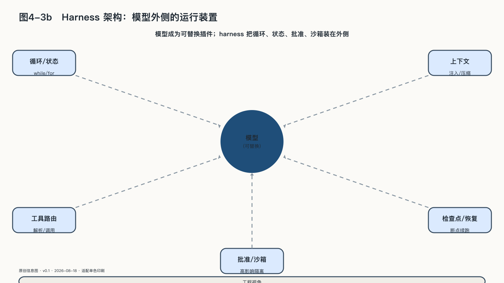

## Harness工程：模型外侧的运行装置

六类方法里，提示、上下文、工具、评测和轨迹各自改造任务的一个侧面；harness组织的是模型外侧的整个运行环境。

**Agent harness**可以直译为智能体运行脚手架，但它并不是用完即拆的临时架子。模型本身只能根据当前输入产生下一步输出；harness在模型外侧维持“观察—判断—调用工具—取得结果—继续或停止”的循环，并决定这一轮给模型什么上下文、允许它摸到哪些工具、状态写在哪里、何时压缩、何时检查、失败后从哪里恢复。

它也不是某个Agent开发框架的同义词。框架提供通用组件和编程接口；harness是针对一类任务，把模型、指令、上下文、工具、状态、评测和安全边界实际组装起来的方法与运行装置。二〇二六年，OpenAI把仓库可读性、任务地图和持续清理纳入“harness engineering”；Anthropic用任务拆分、结构化交接和生成—评估循环支持长任务；Microsoft则把循环、计划、记忆、批准和遥测列为通用Agent harness的组成部分。共同变化是：工程对象已从“调好一个模型”扩大为“设计模型所在的工作环境”。[^p4-harness-engineering-2026]

二〇二六年八月十三日，这条线从工程博客走进了开源仓库。DeepSeek以MIT协议发布DeepSeek Harness开发者预览版，口号是“一切都是插件”：从模型适配器、工具注册表、会话记录、沙箱到Agent循环本身，都是挂载在同一插件内核上的可替换插件，没有哪个组件享有特权。官方公式是“模型加Harness等于Agent”——一家靠开放权重改变过模型竞争格局的公司，这次开放的是模型外侧的运行装置，顺手把自己的模型也放进了可替换的位置。发布方明确警告这是会有破坏性变更的早期版本，离生产使用还有距离。[^p4-deepseek-harness-2026]

几家在模型能力上竞争最激烈的公司，在工程方法上得出了几乎一致的结论：差距不再只产生在模型内部，而产生在模型外侧的运行环境里。DeepSeek把这句结论变成了可下载的代码：harness不再只是各家闭门打磨的手艺，开始成为可以检查、复用和共同改造的公共构件。模型领先需要前沿训练集群，运行环境的设计能力却可以学习、积累——谁先把任务现场的经验沉淀成自己的harness与评测，谁就在模型下一次换代时少交一次学费。

还要区分Agent harness与**评测harness**：前者让模型完成任务，后者批量提供任务和环境、记录试验、调用评分器并汇总结果。评测真正比较的不是裸模型，而是模型与Agent harness组成的系统。

未来模型会更强，Agent会运行得更久，协议与工具也会改变，稳定的控制面不应把某个模型或某一版harness当成永远不变的中心。二〇二六年的长任务工程实践开始把会变化的“脑”、组织循环的harness、持久会话记录与执行动作的沙箱拆成可替换接口；DeepSeek Harness把同一原则推到harness内部——连组织循环的装置自身也由插件组成。[^p4-managed-agents-2026][^p4-deepseek-harness-2026] 目的是让底层实现变化时，任务状态和恢复能力不随之消失。旧harness为旧模型补上的限制，可能在新模型上变成累赘，harness本身也必须版本化、评测和退役。

运行装置就位以后，问题回到任务本身：一次委托从哪开始、到哪才算完成，要先约定下来——这是AgenticOps交给每一项任务的第一份文件。
