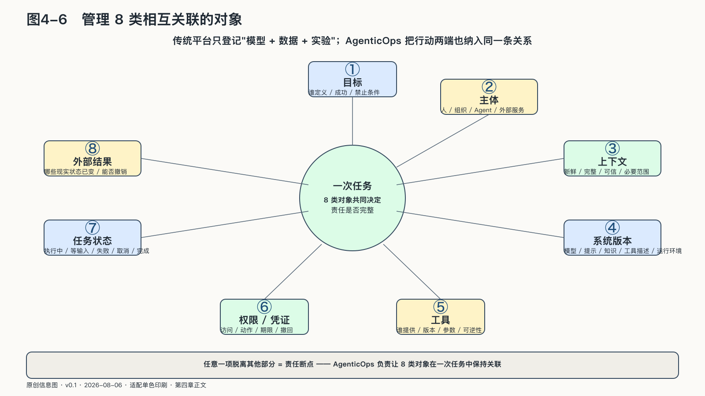

## 管理八类相互关联的对象

传统模型平台主要登记模型、数据和实验。一旦系统开始行动，只登记“用了哪个模型”就像只登记“谁进了办公楼”，却不登记他进了哪个房间、动了哪份文件。AgenticOps必须把行动两端也纳入同一条关系。

**目标。** 谁定义任务，成功与禁止条件是什么，目标改变后旧任务是否仍应继续。

**主体。** 人、组织、Agent和外部服务分别是谁，谁代表谁，责任能否沿委托链还原。

**上下文。** 数据从哪里来，是否新鲜、完整、可信，敏感信息是否超出必要范围。

**系统版本。** 实际运行的模型、提示、知识、记忆策略、工具描述和运行环境是什么，哪一次变化可能改变行为。

**工具。** 能力由谁提供，版本是否可信，参数与返回怎样校验，动作是否可逆。

**权限与凭证。** 允许访问什么资源、采取什么动作、持续多久、能否再委托以及怎样撤回。

**任务状态。** 正在执行、等待输入、等待批准、失败、取消还是完成；重试是否安全，剩余预算多少。

**外部结果。** 哪些现实状态已经改变，是否真的完成，能否撤销、补偿和向受影响者说明。

任何一项脱离其他部分，都可能制造责任断点。日志记录了工具调用，却不知道用谁的权限；知道模型版本，却不知道检索了哪份制度；记录任务“完成”，却没有外部订单号；保存结果，却无法还原谁批准。

一份完整清单仍不等于控制。AgenticOps的作用，是让八类对象在一次任务中保持关联，并在系统变化以后继续可读、可比较、可迁移。

这也是为什么组织首先需要Agent登记册，而不是更多聊天窗口。登记册至少应回答：有哪些Agent，服务什么任务，谁负责，使用哪些高风险工具，接触什么敏感数据，当前版本和评测状态是什么，如何暂停与退役。

随着个人和部门能够自行创建Agent，智能体数量可能增长得比传统应用更快。风险不只来自某个Agent能力过强，也来自大量无人负责、长期持有权限、从未重新评测的“影子Agent”。
