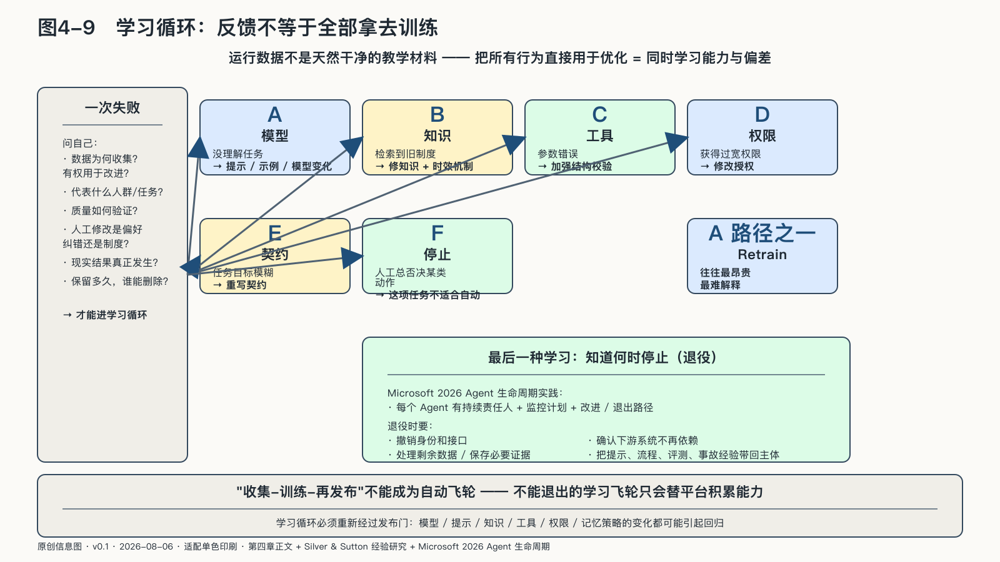

## 学习循环：反馈怎样进入改进

AgenticOps最有吸引力的承诺，是运行越久，系统越理解真实工作。OpenCSG早期方法把Operate之后的反馈送往Retrain，强调“模型每天变化，数据持续复利”。这个方向抓住了企业稀缺资产从通用模型转向任务经验的趋势，但“收集—训练—再发布”不能成为自动飞轮。

运行数据不是天然干净的教学材料。用户可能误点确认，历史结果可能包含歧视与错误，攻击内容可能故意进入记忆，少数人的投诉也可能被平均指标淹没。把所有行为直接用于优化，会让系统同时学习能力与偏差。

反馈进入学习循环以前，至少要回答：数据为何收集，是否有权用于改进；它代表什么人群和任务；质量怎样验证；人工修改是偏好、纠错还是制度要求；现实结果是否已经发生；保留多久，谁能删除。

一次失败可以进入不同路径。

- 模型没有理解任务，可能需要提示、示例或模型变化；
- 检索到旧制度，应修知识与时效机制；
- 工具参数错误，应加强结构校验；
- Agent获得过宽权限，应修改授权；
- 任务目标本身模糊，应重写契约；
- 人工总是否决某类动作，可能说明这项任务不适合自动执行。

再训练只是其中一种，而且往往是最昂贵、最难解释的一种。许多高价值改进来自更好的流程、工具和评测，而不是修改模型参数。

David Silver与Richard Sutton把长期行动、观察和结果流视为智能体获得经验的重要来源，同时指出长时自主运行会减少人的介入点，使追踪与控制更困难。这个研究纲领还没有证明所有Agent都能从经验中可靠学习；它说明运行经验将更重要，也更需要被治理。[^p6-era-experience]

学习循环必须重新经过发布门：模型、提示、知识、工具、权限和记忆策略的变化都可能引起回归，旧版本通过的测试不能自动继承，评测装置本身也要接受复核。

最后一种学习，是知道何时停止。Microsoft二〇二六年的Agent生命周期实践把退役列为正式阶段，要求每个Agent有持续责任人、监控计划以及改进或退出路径。它是厂商实践而非普遍标准，但“退役是健康结果而非失败”这一判断具有通用意义。[^p4-agent-lifecycle-2026]

退役时，身份和接口要撤销，剩余数据要处理，必要证据要保存，下游依赖也要逐项解除。提示、流程、评测、事故经验和人工反馈如果不能随之带回，所谓学习飞轮学到的东西就只留给了平台。
