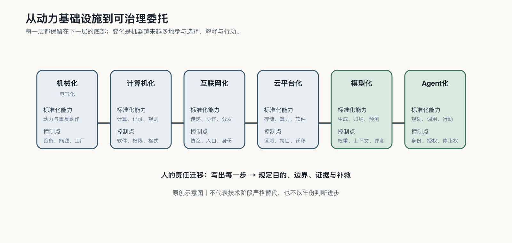

## 从计算工业化到认知与行动工业化

一张电子表格可以在瞬间重算一万行数字，但它不会自己决定应该调哪个单元格。传统软件把人已经说清的规则执行得又快又准；今天的模型则允许人只说目标，再由机器生成内容、补齐步骤，甚至选择下一个工具。

这就是计算工业化与认知、行动工业化之间最关键的一步。机器不只执行路线，也开始参与绘制路线。

| 基础设施阶段 | 被标准化的能力 | 主要控制点 | 仍然保留的人的责任 |
|---|---|---|---|
| 机械化与电气化 | 动力、重复动作、连续生产 | 设备、能源、工厂与标准 | 目标、设计、劳动组织与安全 |
| 计算机化 | 计算、记录、规则执行 | 软件、数据格式、系统权限 | 规则定义、异常处理与审计 |
| 互联网化 | 信息传递、协作与分发 | 网络入口、协议、平台与身份 | 来源判断、关系维护与公共规则 |
| 云与平台化 | 存储、算力、软件的按需调用 | 云区域、接口、计费与迁移 | 选择供应商、配置边界与退出 |
| 模型化 | 生成、归纳、预测与自然语言交互 | 模型权重、训练数据、上下文与评测 | 任务目的、事实核验与责任 |
| Agent化 | 连续规划、工具调用与外部行动 | 身份、授权、凭证、日志与停止权 | 委托、批准、申诉与补救 |

表里的阶段没有依次退场。工厂仍在转，软件仍在执行规则，云仍在提供服务器。新增的是机器参与工作的深度。机器每多做一层，人就必须多管一层：到了智能体阶段，不仅要检查输出，还要管理身份、权限和停止条件。[^p0-infrastructure-history]

人少写了步骤，代价是必须在执行中检查模型如何理解目标、选用资料和采取行动。过去，一个程序出错，工程师首先找哪条规则写错了；现在，他还要查上下文、模型版本、工具权限和当时生成的行动路径。

这种改变让过去昂贵的表达、研究和软件能力开始进入小企业、学校、医院和公共部门。它也把一种新的不稳定带进了这些地方。

截至二〇二六年，斯坦福AI Index记录了一道鲜明的“锯齿边界”：系统能解高难度题，也会在简单感知和长任务中意外失败。AI已足够有用，能够进入生产；它又远未可靠到可以脱离治理。[^p0-ai-world]

这道边界把治理变成生产条件：谁给机器数据和权限，谁检查结果，错误发生后怎样撤回动作、补救损失，都不能留给模型自己回答。AI每向现实多走一步，就多形成一层委托；而这项能力越容易取得，委托关系就会扩散到越多主体。
