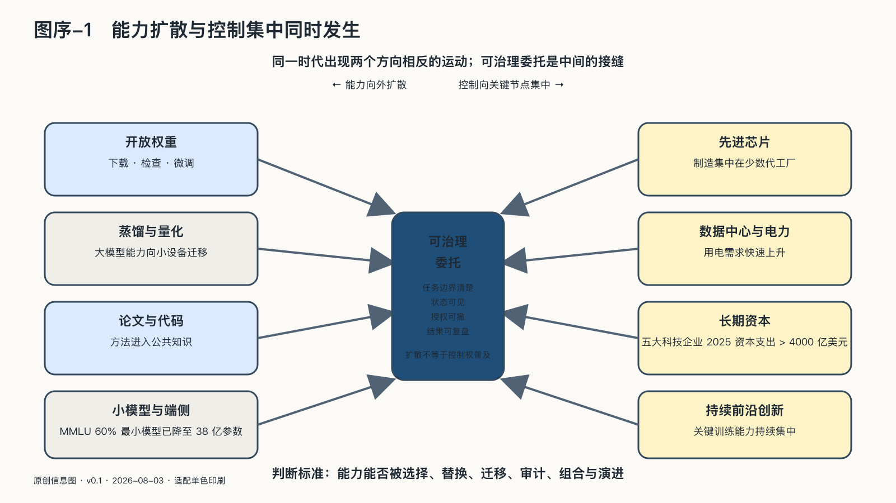

## 能力扩散与控制集中同时发生

AI世界最容易被误读的地方，是把扩散与集中看成只能出现一个。

一方面，模型调用价格下降，开放权重不断增加，蒸馏、量化和小模型降低部署门槛。过去需要专门团队完成的翻译、编程、内容制作和数据分析，正在进入普通软件和个人设备。能力从少数实验室向企业、组织和个人扩散。

这种扩散已经可以用几组不同尺度的数字看见。Stanford AI Index比较的是相近能力，而不是单纯比较最新模型的标价：达到GPT-3.5同等MMLU成绩的系统，公开推理价格从二〇二二年十一月每百万Token约二十美元，降到二〇二四年十月约零点零七美元，约下降二百八十六倍。另一条线是部署规模：达到MMLU百分之六十门槛的最小模型，从二〇二二年的五千四百亿参数降到二〇二四年的三十八亿参数。前者把原本昂贵的调用带进普通软件，后者把部分能力带到本地设备；两者都不等于完整任务成本下降，也不等于小模型全面等同大模型。[^p1-inference-cost][^p1-two-frontiers]

二〇二六年的模型谱系让这两条线变得更容易看见。Kimi K3公开的是二点八万亿总参数、约一千零四十亿激活参数和一百万Token上下文；DeepSeek V4则同时推出一点六万亿总参数、四百九十亿激活参数的Pro版，以及二千八百四十亿总参数、约一百三十亿激活参数的Flash版。这里的“大”不只是参数更多，也包括更大的专家池、更长的上下文和更复杂的推理服务；“小”也不只是把同一个模型裁掉，而是把语音识别、分类、函数调用、脱敏和端侧多模态等能力拆成更适合现场的专门模型。上述参数与产品规格来自项目方，性能比较仍受评测设置限制。[^p1-frontier-models-2026]

普通用户通常不会直接感受到参数数字的变化，变化体现在工作步骤减少：照片、录音和长文档可以直接进入工作流；简单请求由较小模型快速处理，难题再升级到更强模型；增加推理Token可以换取更长的处理过程；代码助手会读文件、运行测试并反复修改。与此同时，等待、重试、工具权限和人工复核也进入了任务流程。[^p1-user-facing-2026]

真实工作中的证据也呈现出同样的“局部有效”。一项跨行业、持续六个月的随机现场实验覆盖约六千名知识工作者，获得AI工具的人每周处理邮件的时间减少约三小时，但需要团队协调的会议时间没有显著变化；另一项针对四千八百六十七名开发者的企业现场研究报告，代码助手组完成任务数量平均增加百分之二十六，但不同企业差异很大。相反，METR在成熟开源项目上对十六名经验丰富开发者、二百四十六项任务的随机实验中，发现使用当时的AI工具反而使完成时间增加百分之十九。能力进入普通软件，不代表所有工作都自动变快；它更像是把收益和风险一起推入更多人的日常工作。[^p3-work-evidence]

翻译、写作和数据分析也呈现出不同结果。二〇二四年的英语—德语翻译后编辑实验中，二十一名专业译员里有十四人偏好语音合成辅助，但最终质量没有改善，后编辑速度反而下降；四百五十三名专业人士的短期写作实验报告完成时间减少百分之四十、质量提高百分之十八；爱尔兰公共部门的一项预注册实验中，文档理解任务质量提高百分之十七、耗时减少百分之三十四，而同一研究的数据分析任务质量下降百分之十二、耗时没有显著变化。能力进入普通软件以后，更多人可以调用它，组织仍需判断哪些任务适合自动化、哪些任务需要专业判断。[^p3-task-boundaries]

最近的真实工作研究把这条边界画得更细。芬兰社会与医疗服务团队让四名内部译员在908个翻译片段上使用GPT-4做后编辑，平均速度提高14%，但芬兰语—瑞典语只有11%、芬兰语—英语只有16%的输出可以不经修改直接通过；另一项阿根廷随机实验让1,174名成年人完成带激励的商业分析任务，GPT-4.1把低技能与高技能参与者的分差从0.548个标准差缩小到0.139个标准差，约闭合74%的基线差距，却没有把差距变成零。也就是说，AI确实把翻译和分析能力带给了更多人，但它带来的首先是“更快得到可工作的草稿”和“降低部分技能门槛”，不是免除术语核对、数据理解和最终责任。[^p3-finland-translation][^p3-argentina-ai]

内容制作也已经从“能不能生成”进入“生成后是否被受众接受”的阶段。一项同行评审的营销研究先比较10,320张AI图像与2,400张人工图像，再观察超过173,000次广告曝光；在特定横幅广告场景中，表现最好的AI图像点击率比人工图库图高50%。这证明的是某类营销素材能获得更高点击，不是品牌、新闻或公共传播的长期质量；但它足以说明，内容生产的门槛已经从“有没有设计团队”转向“能否快速生成、筛选、验证并承担传播后果”。[^p3-ai-marketing]

另一方面，前沿训练和大规模推理越来越依赖昂贵芯片、高速网络、电力、数据中心和长期资本。截至二〇二六年，产业界生产了绝大多数代表性前沿模型；国际能源署估计，仅五家大型科技企业二〇二五年的资本支出就超过四千亿美元，数据中心用电需求也在快速上升。[^p0-ai-world][^p0-ai-energy]

于是，同一时代出现了两个方向相反的运动：获得某种智能越来越容易，持续生产最前沿智能的基础设施却可能越来越集中。

这与二十世纪的工业集中并不完全相同。个人不需要拥有电厂才能使用电，也不需要建造晶圆厂才能编写软件。问题在于，AI不仅供应一种通用资源，还可能积累使用者的上下文、偏好、数据、客户关系与工作流程。服务越好用，使用者留下的经验越多；积累越深，迁移的成本越高。

能力普及不会自动分散控制权。个人可能获得更高生产力，却更加依赖少数账户；企业可以接入先进模型，却逐渐说不清任务怎样完成、数据怎样流动、反馈向谁沉淀；国家即使拥有数据中心，也可能无法修改软件栈、替换模型或维持关键服务。

AI主权首先来自这个矛盾，而不是来自某个国家或企业对“主权”一词的宣传。
