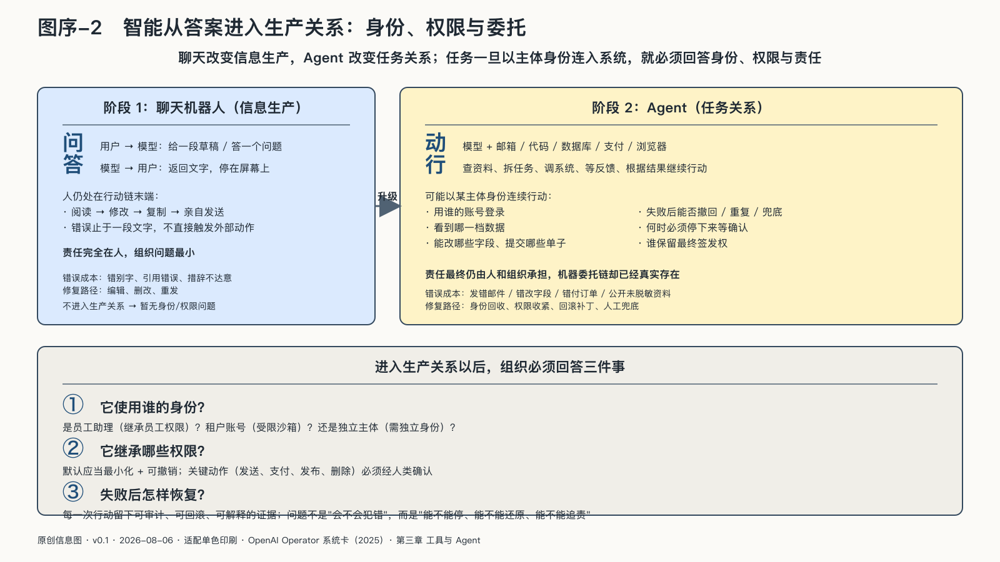

## 智能正在从答案进入生产关系

二〇二五年，OpenAI在Operator系统卡中公布了一组很不“聊天”的测试。在一百项接近真实的浏览器任务中，未加产品防护的模型出现了十三次会造成麻烦的错误，其中五次较难逆转或可能较严重。另一组六百零七项风险动作测试中，要求用户确认的机制报告了约百分之九十二的召回率。这些是厂商自测，不是真实事故率；但它们揭示了一个新问题：当模型能点击、输入和提交，错误就不再停留在一段文字里。[^p6-operator]

聊天机器人主要改变信息生产，Agent则开始改变任务关系。草稿的边界是屏幕，行动的边界却由它能够接入的账户、工具和现场决定。模型获得邮箱、代码仓库、数据库、日历、浏览器和支付接口以后，就可能自己查资料、拆任务、调系统、等反馈，再根据结果继续行动。

这种变化不需要等到机器拥有意识。只要软件能代表某个主体连续行动，组织就必须回答：它使用谁的身份，继承哪些权限，什么动作需要确认，失败后怎样恢复。

Agent由此进入生产关系，而不只是多占据一个软件界面。

它不是传统员工，没有与人相同的法律地位和责任能力；它也不再只是传统软件，因为行动路径可能由模型当场生成。责任最终仍由人和组织承担，机器委托链却已经真实存在。

这也让“主权”从静态所有权问题转向运行问题。服务器归谁、模型来自哪里、合同写了什么仍然重要；但决定一项任务是否可控的，是运行时谁能签发身份、限制权限、选择模型、核验结果、停止行动和取得证据。

当答案变成动作，模型能力的增长就不只改变软件，也开始改变一项工作需要多少人、怎样分工以及由谁负责。
