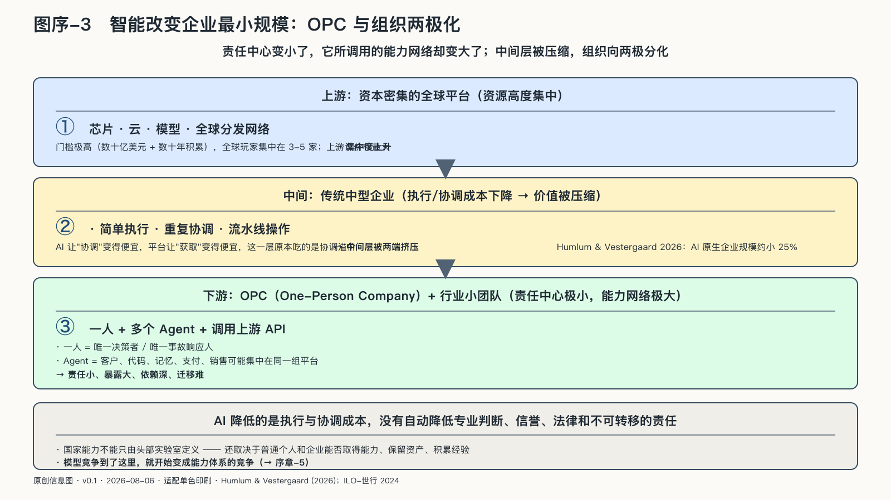

## 智能正在改变企业的最小规模

一篇二〇二六年发布的工作论文，把Y Combinator二〇二〇至二〇二四年批次及美国风险投资创业公司的人员数据连在了一起。作者报告，在相同行业和批次中，AI原生企业的规模约小百分之二十五，工程师占比更高，初级员工和管理者占比更低。这只是年轻风投企业的工作论文，既不证明AI必然让企业裁员，也不能外推到所有行业。但它抓住了一个正在显形的问题：一家能持续交付产品的公司，到底还需要多少人？[^p10-ai-native-firms]

工业时代的大公司之所以庞大，部分原因在于：在市场上不断寻找、谈判和监督所需能力，成本太高，不如把它们收进同一个组织。云和平台已经降低了外部协作成本，AI又在降低研究、表达、开发和日常协调的成本。成本结构一变，企业的合理规模就会跟着移动。这条线索的完整论证在第五章，这里先记住它的方向。

OPC——One-Person Company，一人公司——是这场变化的极端形态：一个人编排多个Agent，调用模型、云服务、支付和专业网络，完成过去需要多个岗位的业务。它的能力和脆弱来自同一个事实：责任中心变小了，调用的能力网络却变大了。客户资料、代码、记忆和支付可能集中在同一组平台上，创始人既是最终决策者，也是唯一的事故响应人员。

企业最小规模的移动还只是信号，不构成结论。但它已经足以提示：一个国家的AI能力不能只由头部实验室定义，还取决于普通个人和小团队能否取得能力、保留资产。模型竞争到了这里，就开始变成能力体系的竞争。
