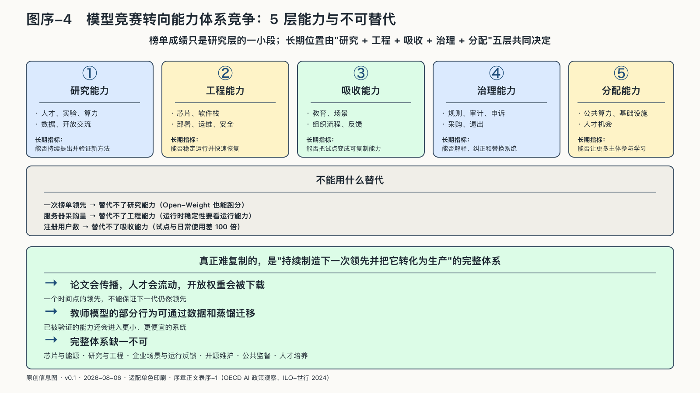

## 世界正在从模型竞赛转向能力体系竞争

一个国家可以购买计算时间，下载开放权重，甚至在一次榜单上取得很好的成绩。但当模型需要升级，芯片供应中断，数据出现争议，或一个公共系统开始犯错时，榜单无法替它恢复服务。

所以，模型领先仍然重要，却越来越难单独代表一个国家或企业的长期位置。

| 能力层 | 需要什么 | 可观察的长期指标 | 不能用什么替代 |
|---|---|---|---|
| 研究能力 | 人才、实验、算力、数据与开放交流 | 能否持续提出并验证新方法 | 一次榜单领先 |
| 工程能力 | 芯片、软件栈、部署、运维与安全 | 能否稳定运行并快速恢复 | 服务器采购量 |
| 吸收能力 | 教育、场景、组织流程与反馈 | 能否把试点变成可复制能力 | 注册用户数 |
| 治理能力 | 规则、审计、申诉、采购与退出 | 能否解释、纠正和替换系统 | 合规文件数量 |
| 分配能力 | 公共算力、基础设施和人才机会 | 能否让更多主体参与学习与生产 | 单一中心的峰值性能 |

论文会传播，人才会流动，开放权重会被下载，教师模型的部分行为可以通过数据和蒸馏迁移，已经被验证的能力还会进入更小、更便宜的系统。一个模型在某个时间点领先，并不保证下一代仍然领先。

更难复制的，是持续制造下一次领先，并把它转化为生产的完整体系：芯片与能源、研究与工程、企业场景与运行反馈、开源维护、公共监督与人才培养，缺一不可。

美国国家人工智能研究资源试点提供了另一种观察窗口。截至二〇二六年八月，美国国家科学基金会称该试点已支持六百多个研究项目和六千名学生，覆盖五十个州、华盛顿特区与波多黎各；英国AIRR计算机会则对单个项目开放二十万至一百万GPU小时的申请。这些统计只能证明公共资源分配机制已经开始运行，不证明每个项目都会产生成果。它们对“国家AI竞争”的启发是：峰值算力之外，谁能进入学习和生产，同样是国家能力。[^p7-public-compute-2026]

国家AI竞争正在从“拥有哪个模型”转向“怎样组织能力”。

不同地区的优势也不相同：中国有用户、产业场景和开放权重生态，中东有能源、资本和国际合作，东南亚则可以围绕语言、本地应用和区域协同建立位置。各自的短板，也决定了它们需要何种能力体系。

发展中国家的处境尤其说明，使用AI和从AI中获得发展收益不是一回事。国际劳工组织与世界银行覆盖一百三十五个国家的研究指出，一些发展中经济体可能先承受工作扰动，却因数字基础设施、技能和任务结构差异而较晚取得生产率红利。[^p0-global-divide]

未来世界不会简单分成“拥有AI的国家”和“没有AI的国家”。更可能出现的是一张不对称的多中心网络：不同地区掌握不同的算力、能源、模型、语言、数据、市场与规则能力，又无法彼此切断。当依赖无法消除，“主权”就必须被重新定义。
