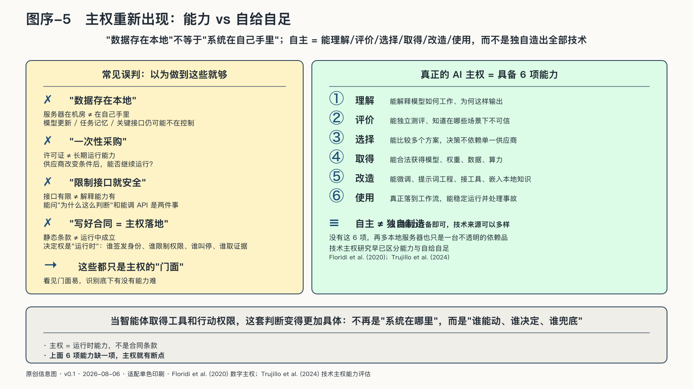
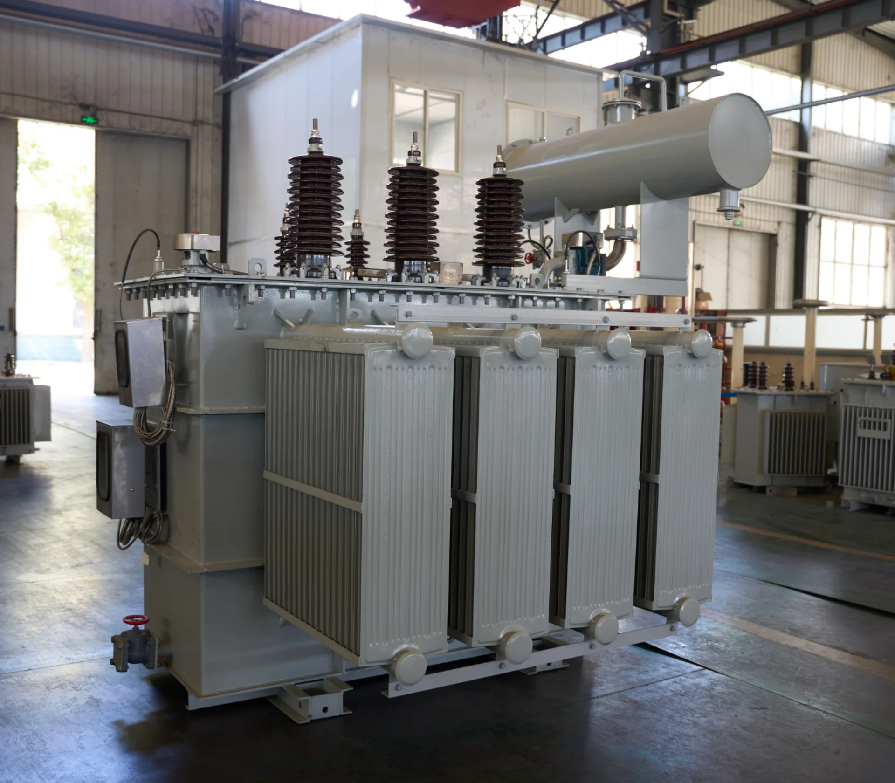

## 主权为什么在这个时代重新出现

“数据存在本地”，是不是就代表系统在自己手里？

不一定。一家机构可以把服务器放在自己机房，却仍然无法检查模型怎样更新，无法导出任务记忆，无法替换关键接口，也无法在供应商改变条件后继续运行。服务器的地理位置是控制的一部分，不是控制的全部。

“主权”历史悠久，也很容易被滥用。国家主权涉及领土、法律与公共权力，个人、组织单元和企业当然不以相同意义拥有国家主权。本书在这些层级使用“AI主权”，指的是它们在智能系统中保持理解、选择、授权、迁移、质疑和负责的能力。

这个概念也不只是给数字主权换个名字。数据时代主要关心资料存在哪里、谁能访问；AI又增加了模型如何解释数据、任务如何形成、工具怎样调用、反馈沉淀到哪里。即使原始数据没有离开，外部模型、接口和更新机制仍可能改变结果。

AI主权不要求把一切留在本地，也不能简化成只购买某一来源的模型。技术主权研究已经区分能力与自给自足：自主不等于独自制造全部技术，而在于能否理解、评价、选择、取得、改造和使用关键技术。[^p3-tech-sovereignty]

智能体取得工具和行动权限以后，这项判断可以写得更具体：

> **AI主权是在深度依赖中治理机器委托的能力。**

外部模型可以使用，国际供应链可以合作，开源与商业服务也可以组合；但任务由谁定义、数据怎样进入、机器能做什么、结果怎样核验、关键资产向谁沉淀、错误怎样补救，不能在便利中变成无人负责的默认设置。

技术来源替代回答的是购买谁；主权化还要追问，继续使用外部技术时，关键条件是否仍能由自己决定。
