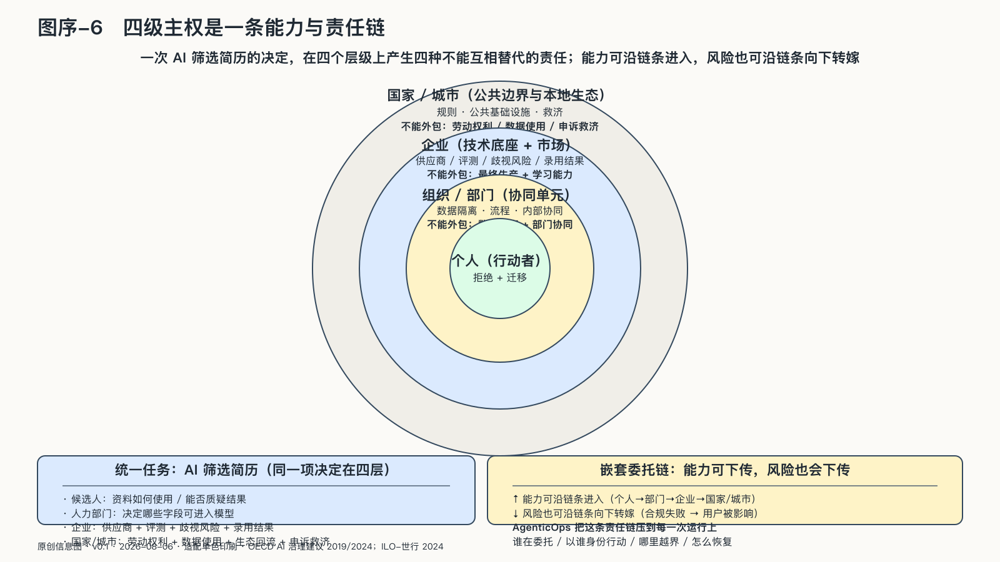

## 四级主权是一条能力与责任链

把AI筛选简历这项常见应用拆开，一个结果会同时追问四个不同的主体。这里不指向某一起具体事件，而是用一条典型任务链看清责任怎样分层。

候选人要知道自己的资料怎样被使用，并有机会质疑结果。人力部门要决定哪些简历、面试记录和职位条件可以进入模型。企业要为供应商、评测、歧视风险和最终录用结果负责。政府则要设定劳动权利、数据使用与救济的公共边界。

同一个决定，在四个层级上产生了四种不能互相替代的责任。

这就是本书所说的四级AI主权。它不是把国家主权这个法律概念平均分给个人、部门和公司，而是追问每一层能授权什么，又有什么责任不能外包。

这四个层级组成一条嵌套的委托链。个人使用工具，部门组织共同任务，企业提供技术底座并连接市场，政府制定规则、建设基础设施。而政府本身又依赖企业、开源项目和全球供应链。能力可以沿链条进入，风险也可以沿链条向下转嫁。

每一层都需要保有与自身责任相匹配的能力：个人能够拒绝和迁移，组织单元能够隔离数据并完成必要协同，企业能够维持生产与学习，国家能够组织公共能力并保护下层主体的选择。它们不需要彼此脱离，却必须能互相约束。

AgenticOps再把这条责任链落到每一次运行：谁在委托，系统以谁的身份行动，哪里越界，发生了什么，又应该怎样恢复。四级责任只有进入这些具体问题，才能接受现实检验。
