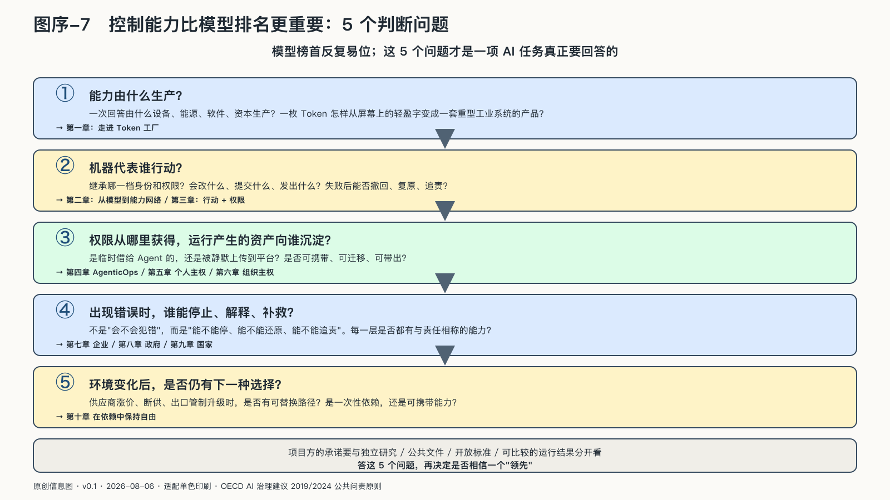

## 控制能力比模型排名更重要

在这本书的写作周期里，模型榜首已经反复易位，调用价格不断下降，产品名称和接口也一再更新。如果一本书把论证绑在这些名字上，它离开印刷厂时就可能已经过时。

更稳定的问题，藏在一项AI任务的整条链上：能力由什么生产，机器代表谁行动，权限从哪里获得，运行产生的资产向谁沉淀，出现错误时谁能停止、解释和补救，环境变化以后又是否仍有下一种选择。判断一个主体在AI时代的位置，看的不是它用过哪个排名第一的模型，而是它对这条链的控制能力。

开放模型、资产平台、Agent、OPC和城市算力项目，会在后文中从不同层级回答这些问题。它们能说明系统怎样建设，不能单独证明某条路线一定成功。项目方的承诺要与独立研究、公共文件、开放标准和可比较的运行结果分开。

但回答控制问题以前，必须先看见依赖。一次回答由什么设备、能源、软件和资本生产？一枚Token怎样从屏幕上轻盈的字，变成一套重型工业系统的产品？

这场权力变化的物理起点，是聊天框背后的Token生产系统。

序章到这里只完成了一半工作：它说明智能权力正在重新分配，却没有说明这种权力以什么形式被生产出来、又怎样进入日常。答案不在声明和榜单里，而在生产现场。这是下一章要回答的问题。
