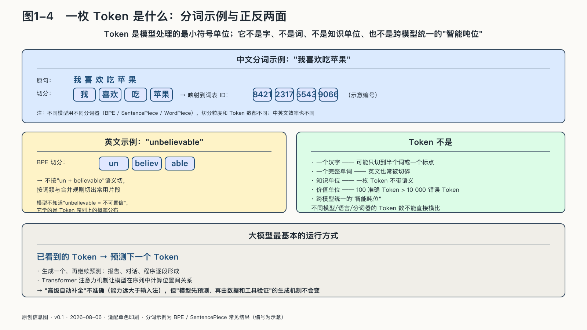

## 一枚Token是什么

在用户眼里，输入框里是一句话。在模型眼里，它首先是一串编号。

连“AI主权”这样四个汉字，也未必被不同模型切成四个相同单元。文字送进神经网络以前，分词器会先完成切分，再把每一块映射为词表中的数字。这些块就是Token，常被翻译为“令牌”或“词元”。

一枚Token可能是一个字、一个词的一部分、一个标点、一段空格，甚至是字节组合。不同模型使用不同分词器，同一句话会被切成不同数量的Token；中文、英文及其他语言的切分效率也不相同。模型处理的，是这些编号在上下文中的关系。[^p1-tokenizer]

Token经常被误当成知识、价值或跨模型通用的能力单位，需要先排除这几种理解。

- 它不是知识单位。一个Token可能只是半个词或一个标点。
- 它不是价值单位。一百个准确而简洁的Token，可能比一万个重复或错误的Token更有价值。
- 它不是跨模型统一的“智能吨位”。不同模型、语言和分词器的Token数不能直接横向比较。

现代大语言模型最基础的运行方式，是根据已经看到的Token，预测下一个Token。生成一个，再继续预测。报告、对话和程序，就是这样逐段形成的。Transformer的注意力机制让模型能够在一段序列中计算不同位置之间的关系，成为当代大语言模型的关键技术基础。[^p1-transformer]

“预测下一个Token”听起来像手机输入法，于是有人把大模型贬为“高级自动补全”。这也不准确。规模化训练会让模型在参数中形成可迁移的表示和模式，使它能够翻译、概括、编程、分类并处理训练中没有逐字出现的新任务。它的能力远大于普通输入法，但能力的外观不能改变它的生成机制：模型首先生成在上下文中合适的后续，而不是先去现实世界核验每一句话。

同一种生成机制带来了两种结果：模型能够组合大量语言模式，写出人没有预先编好的回答；也可能把真实姓名、专业语气和虚构事实组合成一段极具说服力的文字。流畅可以直接来自生成过程，真实却需要数据、检索、工具和验证程序共同保证，生产速度因此不能替代质量判断。

Token自身不分真假。流畅由生成机制免费提供，真实却永远是额外工序——把流畅与可信区分开的全部工作，都被推给了数据、检索、工具，以及使用系统的人。
