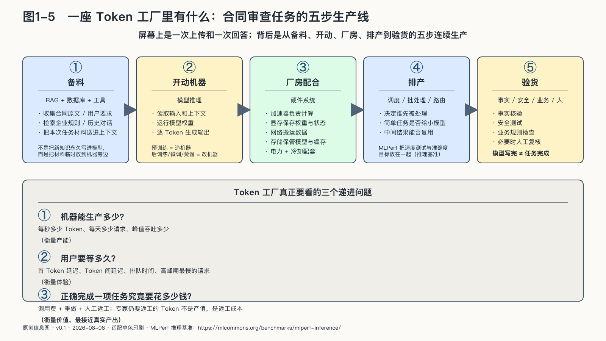

## 一座Token工厂里有什么

这里所说的“工厂”，包括从接到问题到交出结果的整条生产线，不限于摆放GPU的建筑。一条生产线真正的分量不在厂房，而在控制点——备料、机器、排产、验货，每个环节背后都站着一个“谁说了算”。

假设一家企业把合同交给AI审查。屏幕上只有一次上传和一次回答，背后却要经过五个环节。

**第一步是备料。** 系统先收集合同原文、用户要求、历史对话和企业自己的审查规则。基础模型虽然在训练中读过大量文本，却不知道这份合同刚刚改了哪一条，也不知道企业今天执行什么标准。RAG——检索增强生成——所做的，就是从外部知识库找到相关材料，再把它们放进这一次任务的上下文。数据库和工具调用也能提供最新状态。它们不是把新知识永久写进模型，而是把本次任务需要的材料临时送到机器旁边。

**第二步是开动机器。** 训练完成的模型读取这些材料，进行推理并逐个生成Token。预训练相当于把机器造出来；后训练、微调、蒸馏和量化，则像调整机器的行为、用途、尺寸或能耗。订单到来以后，反复运行的是已经训练好的模型。

**第三步是让厂房配合。** 模型不能悬在空中工作。加速器负责计算，显存保存权重和中间状态，网络在设备之间搬运数据，存储系统保管模型与缓存，电力驱动整套设备，冷却系统带走热量。任何一处不足，都可能让回答变慢、变贵，甚至无法提供服务。

**第四步是排产。** 同一时刻往往有许多请求进入系统。调度器要决定哪些请求先处理，哪些合并成一批，哪些中间结果可以复用，简单问题是否交给较小模型。这里没有一个指标可以独自代表效率：第一枚Token出现得快，不等于整套系统服务的人多；系统总吞吐量高，也不等于高峰期最慢的用户不用久等。

MLPerf等推理基准把速度测试和准确度目标放在一起，原因正在这里：一条生产线如果只是更快地交出错误答案，不能算性能更好。[^p1-mlperf]

**第五步是验货。** 输出还要经过事实核验、安全测试、业务规则检查，必要时由人复核。模型写完，不等于任务完成。合同审查的结果如果漏掉关键风险，前面生成得再流畅，也只是把错误更快地送到用户面前。

对使用者而言，这条生产线也展开了不同的控制点。谁决定进入上下文的材料，谁选择模型与运行环境，谁设定调度优先级，谁掌握验货标准，可能分别是不同主体。只拿到最后一段回答，使用者看不见这些决定，也很难判断依赖如何形成。

因此，衡量一座Token工厂不能只看每秒生成多少Token，还要依次追问：机器能生产多少，用户要等多久，正确完成一项任务究竟要花多少钱。

最后一个问题最接近真实价值。如果模型生成了一万Token，专家仍然要从头重做，这些Token就不是产值，而是返工成本。Token可以计量生产过程，却不能替代对结果的判断。
