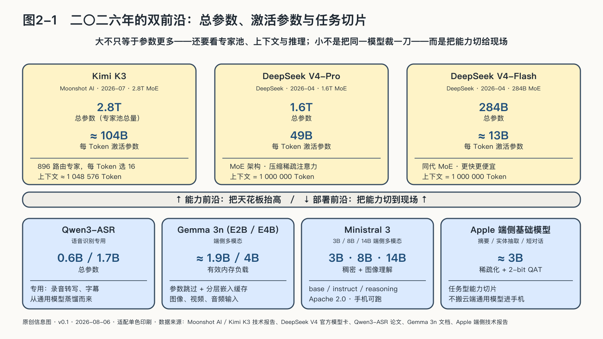

## 模型为什么同时变大又变小

二〇二四年，一个三十八亿参数的模型被装进了手机。参数是模型在训练中调整的内部数值，可以粗略反映模型容量，却不等于它记住了多少条知识。Token则是模型读写文字时使用的基本单位，一个汉字、词的一部分或标点都可能成为一个Token。

微软在Phi-3技术报告中称，这个用三点三万亿Token训练的小模型，在MMLU测试中得分约百分之六十九。MMLU是一套覆盖多门学科的选择题测试，只能代表通用知识与解题能力的一部分。同一年，Apple公布的端侧模型约三十亿参数，在iPhone 15 Pro上的生成速度约为每秒三十个Token。[^p2-device-models]

而在另一端，前沿模型还在向万亿参数迈进。二〇二六年公开的Kimi K3共有二点八万亿参数，DeepSeek V4-Pro为一点六万亿。一边是手机里的三十亿，一边是数据中心里的万亿：如果只用“大吃小”理解模型竞争，这幅图景是矛盾的。

因为它们并不在争同一个位置。

### Scaling Law推高的，是天花板

二〇二〇年，OpenAI研究者Jared Kaplan等人给出了一组后来被产业界反复引用的经验规律：当模型参数、训练数据和计算量增加时，语言模型的预测损失会按幂律下降。说得直白一些：在实验范围内，多投数据、算力和参数，模型的下一个词通常会猜得更准。这就是所谓的Scaling Law，也是前沿实验室敢于下注超大集群的一个理由。[^p2-two-frontiers]

但Scaling Law不能简化成“参数越多越好”。二〇二二年，Google DeepMind的Chinchilla实验纠正了这种粗暴理解。它只有七百亿参数，不到Gopher二千八百亿参数的四分之一；但它看过约四倍的训练数据，在相近训练计算预算下，在论文所测的大多数任务中超过了Gopher。扩大训练规模时，每多一分计算，都要在参数、数据和训练步数之间重新分配。[^p1-chinchilla]

所以，“变大”扩展的是能力前沿，包括更难的推理、更长的上下文、更多模态，以及更复杂的工具使用。参数、数据、训练计算、后训练和推理时计算，都可能成为推高天花板的杠杆。

### 工程师压低的，是地板

一项能力一旦被证明可行，就会有人试着用更少的资源重做一遍。Stanford AI Index 2025给出了一个很有冲击力的数字：达到MMLU百分之六十这道门槛的最小模型，从二〇二二年PaLM的五千四百亿参数，降到二〇二四年Phi-3-mini的三十八亿。两年，缩小约一百四十二倍。[^p2-two-frontiers]

三十八亿参数并没有因此“取代”五千四百亿。MMLU只是一套多学科选择题，既不测长时间任务，也不代表全部推理、安全和工具能力。这个变化能够说明的是：已经跨过的能力门槛，往往会越来越便宜。

这种下降来自一组工程合力：更干净的真实数据和经过筛选的合成数据，提高了每个参数的“产出”；蒸馏让小模型学习大模型在特定任务上展现的行为；剪枝去掉不重要的连接；量化则把原本用十六位甚至三十二位数字存放的权重，压到四位、三位或更低。GPTQ和AWQ降低了推理的显存门槛；QLoRA论文则在其实验中，用一张四十八GB显卡完成了六百五十亿参数量化基座的高效微调。[^p2-two-frontiers]

到了混合专家模型，“大小”甚至不再只有一个数字。Kimi K3处理每个Token时，只从八百九十六个“专家”模块中选择十六个；二点八万亿总参数中，约有一千零四十亿参与这次计算。DeepSeek V4-Pro的公开口径则是一点六万亿总参数、四百九十亿激活参数。

可以把总参数理解为公司的全部专家库，激活参数则是处理当前问题时被叫进会议室的人。但到会人数少，不代表会议一定更快。全部权重仍要存放，系统还要完成专家调度、设备间通信，并保存模型已经读过的上下文状态，也就是KV Cache。这些开销都会进入真实账单。[^p2-frontier-models-2026]

Gemma 3n又把这种“按需调度”带到端侧。它的E2B模型标准运行时需加载超过五十亿参数，却能通过参数跳过和分层嵌入缓存，把有效内存负载压到约十九点一亿参数。需要图像和语音时再加载相应部分。它并非把大模型等比缩小，而是把能力做成可以拆装的模块。[^p2-device-models]

### 大小模型如何进入同一条生产线

一个投入运行的AI系统，未必把所有问题都扔给最强的模型。手机或企业内网里的小模型，可以先做录音转写、OCR、分类和脱敏；路由器根据任务难度、数据敏感度和预算，把少数难题送给云端强模型；确定性程序校验金额、格式和权限；人则保留支付、发布等不可逆决定。[^p2-user-facing-2026]

在这条生产线上，大模型负责试探新能力，也可以生成训练材料、充当教师；小模型把其中稳定、常用、可验证的部分，带到手机、汽车、医院内网和工厂现场。Qwen3同时提供从零点六B稠密模型到二千三百五十亿总参数MoE，Qwen3-ASR又用零点六B和一点七B专门做语音识别，就是这种分工的一个现实缩影。[^p2-small-model-family-2026]

模型产业因而同时沿两条曲线前进：制造下一代前沿能力，需要越来越多芯片、能源、数据和工程协同；使用一项已经成熟的能力，需要的参数、显存和费用却越来越少。

Scaling Law继续抬高能力天花板，工程优化则不断降低使用门槛。天花板与地板之间，夹着每个使用者的真实问题：从大模型流向小模型的那部分能力，究竟经过了谁的手，又留下了什么。
