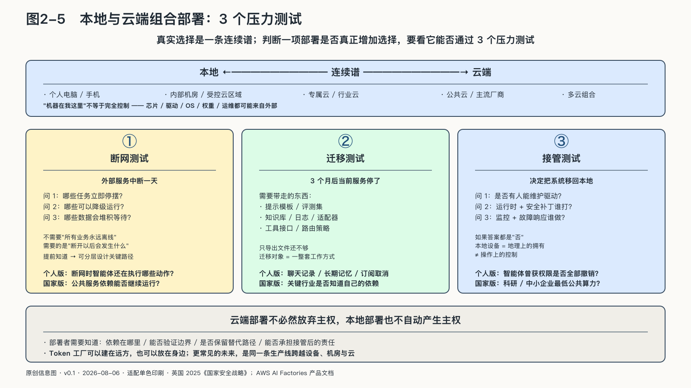

## 本地与云端的组合部署

一份包含客户隐私的录音，未必需要在“全部留在本地”与“整份上传云端”之间二选一。本地模型可以先转写、识别个人信息并脱敏，只把允许外送的困难段落交给云端强模型，最后再由内部程序校验结果。这里描述的是一条典型混合路径，不是某个项目的效果宣称。

部署不是“本地才安全，云端才先进”的站队题，而是一条连续谱。

模型可以运行在个人电脑和手机上，也可以运行在组织机房、托管数据中心、专属云区域或公共云中。同一项业务还可以同时使用多种位置：敏感资料留在内部，小模型先完成分类和脱敏，匿名后的困难问题再交给云端大模型；稳定、重复的请求由自有设备处理，节假日峰值借用云端弹性容量；现场设备承担低延迟控制，云端负责训练、汇总和更新。

把这条路径拆开看，端侧模型可以先做语音转写、OCR、分类和脱敏，路由器再根据数据级别、任务难度和预算选择本地、受控云或公共云；云端强模型只接收允许外送的困难上下文，确定性程序负责金额、格式和权限校验，人类保留发送、支付和发布等不可逆动作。读者感受到的是更少的等待和手工搬运；组织面对的则是路由策略、上下文缓存、模型版本、量化格式、工具权限和日志能否一起迁移。[^p2-user-facing-2026]

决定位置的，不应是一句抽象口号，而是任务的物理与制度条件。

- 数据是否允许离开当前环境？
- 任务能否容忍网络中断和往返延迟？
- 需求是稳定满载，还是偶尔出现峰值？
- 组织有没有维护模型、驱动、推理引擎和安全补丁的团队？
- 是否需要使用只有特定云端提供的前沿模型？
- 发生故障时，备用路径在哪里？
- 监管者和客户需要怎样的审计证据？

本地部署的优势是边界清晰、版本可固定、弱网环境可运行，并可能减少敏感提示和结果离开现场。但“机器在我这里”不等于完全控制。芯片固件、驱动、操作系统、模型权重和维护工具仍可能来自外部；缺乏专业运维的小型机房，也可能比成熟云服务更脆弱。

云端的优势是弹性、规模和持续更新。少量或波动明显的工作负载，可以避免长期闲置设备；复杂训练和短期高峰也更容易迅速获得资源。但云端会把身份、数据、接口、容量和计费集中到合同关系中。迁移是否可行，往往要到价格变化、区域故障或合规要求改变时才会暴露。

到二〇二五年，云厂商甚至开始把完整的云技术栈部署到客户指定的数据中心：设备运行在客户场所，数据平面保持在约定边界内，云厂商继续负责基础设施和服务运营。AWS把这一产品直接称为“AI Factories”。它只是市场中的一种实现，不能证明已经达成完整主权，却说明“物理位置”和“运营控制”可以分别安排：服务器在本地，操作权可能仍属于外部服务商；服务器在云端，密钥、数据和工作负载调度也可能由客户掌握一部分。[^p2-aws-ai-factories]

英国二〇二五年《国家安全战略》对这一点说得格外直接：在AI等前沿技术上，完全的主权独立并不总是可能；英国计划建立一条可独立分配给国家优先任务的主权算力底线，同时承认它很可能只是全国整体算力组合中最小的一部分。[^p2-uk-sovereign-compute]

这类组合把主权目标限定为关键时刻仍能作出决定，而非占有全部资源。

一个成熟的组织不会问“我们究竟站本地还是站云端”，而会把工作负载分层：什么必须留在边缘，什么应进入内部环境，什么可以使用公共云，哪些服务必须准备第二供应商，哪些关键流程在外部连接中断时仍要保持最低运行能力。

这类分层需要持续运营，不能靠一张架构图一次定型。模型价格会变，硬件会折旧，监管范围会调整，业务也会从试验走向关键生产。去年适合云端的低频任务，可能因为调用量增长而适合固定容量；原本留在本地的模型，也可能因为维护困难和能力落后而需要重新组合。

判断一项部署是否增加了现实选择，可以做三个压力测试。

第一个是**断网测试**。外部服务中断一天，哪些任务立即停摆，哪些能够降级运行，哪些数据会堆积等待？企业需要提前知道断开以后会发生什么，而不必要求所有业务永远离线。

第二个是**迁移测试**。如果当前模型或云服务在三个月后停止，提示模板、评测集、知识库、日志、适配器和工具接口能否带走？只导出文件还不够，迁移对象包括一整套工作方式。

第三个是**接管测试**。如果组织决定把系统移回本地，是否有人能维护驱动、运行时、安全补丁和监控？如果答案是否定的，本地设备可能只是地理上的拥有，而不是操作上的控制。

同样的测试也适用于个人。聊天记录能否导出，长期记忆能否删除或迁移，订阅取消后个人建立的工作流是否仍然可用，智能体曾获得的账号权限是否全部撤销——这些看似琐碎的设置，构成了个人层面的退出权。

国家面对的则是放大后的同一问题。公共服务依赖的模型能否在供应中断时继续运行，关键行业是否知道自己的云和芯片依赖，科研与中小企业能否获得最低限度的公共算力，都不是“建一座本地机房”可以单独回答的。

云端部署不必然放弃主权，本地部署也不自动产生主权。部署者需要知道依赖在哪里、能否验证边界、是否保留替代路径，以及能否承担接管后的责任。

Token工厂可以建在远方，也可以放在身边；更常见的未来，是同一条生产线跨越设备、机房与云。AI主权要管理的，正是这些连接，而不是假装连接不存在。

把部署选对，只解决了连接的地理维度。一项任务真正运行时，连接上还挂着数据、工具、身份和人的批准，那才是一次调用的全貌。
