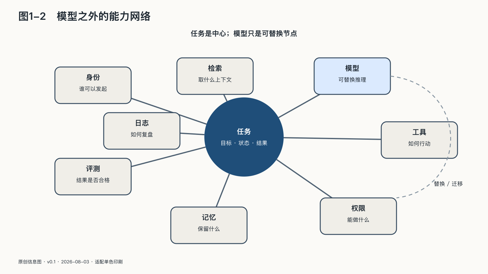

## 模型之外的能力网络

模型排行榜不会告诉你，一个AI助手能否读取公司邮箱，是否拥有生产数据库的写入权，又是否可以绕过人类审批直接发布代码。

这些连接不在模型权重里，却决定了系统最终拥有多大的现实能力。

一个能够替人完成工作的AI系统，通常至少包含模型、上下文、智能体循环和工具。模型负责理解当前状态、生成方案和选择下一步；上下文提供任务、规则与事实；智能体循环决定是否继续观察、思考、调用工具或结束；工具负责读取文件、查询数据库、发送邮件、执行代码和改变外部状态。

这几部分组合以后，能力不是简单相加，而会相互放大。

同一个模型只接聊天窗口时，最多给出一段建议；接入企业知识库后，它可以回答内部问题；接入代码仓库和执行环境后，它可以修改程序；再接入发布系统后，它可能把修改送到真实用户面前。模型本身没有变，系统的实际权力却从“说话”变成了“行动”。

用一条说明性任务链来看：一家企业让智能体准备季度经营报告。这不是某家公司的真实效果案例，只用于拆解能力怎样沿系统连接生成。

它先从数据仓库读取销售与成本，调用分析工具计算变化，再查阅会议纪要解释异常，随后生成图表和文字，最后把文档发给管理层。如果发送之前需要财务负责人确认，这是一条有人把关的生产线；如果智能体还可以自行调整预算、通知供应商和修改销售目标，它就从报告助手变成了经营系统的一部分。

这里并不存在一个独立完成全部工作的“超级模型”。每一步都由不同能力完成：语言模型理解要求，数据库保存事实，计算引擎处理数字，身份系统证明调用者是谁，工作流系统决定下一站，人工审批提供最终授权。任何一个环节失效，都可能改变结果。

这张网络还有三个常被忽略的特点。

第一，能力取决于路径，而不只取决于节点。一个模型即使非常强，如果拿不到正确数据、不能调用必要工具，也完不成任务；一个能力普通的模型如果接入了高质量数据库、稳定流程和专业复核，反而可能产生更可靠的业务结果。

第二，风险也沿路径传播。一封邮件中的恶意指令可能进入模型上下文，模型再把它转化为工具调用；工具使用真实凭证操作外部系统，最终把语言层面的欺骗放大为现实损失。只给模型做安全测试，却不检查整条调用链，就像只检测发动机而不检查刹车和方向盘。

第三，网络会产生隐性锁定。企业以为自己依赖的是某个模型，难以迁移的却可能是身份体系、知识库格式、专用工具、流程编排和历史评测。更换一个API地址很容易，重新建立这些连接及其信任关系却可能耗时数月。

“我们用哪一个模型”只是采购问题的第一层。企业还要确定哪些能力必须由同一家供应商提供、哪些接口需要保持可替换、哪些数据可以跨边界流动，以及哪些关键行动必须保留第二条路径。

判断一个AI系统的能力，不能只问模型在排行榜上得了多少分，还要问：

- 它能看见哪些数据？
- 它可以调用哪些工具？
- 它以谁的身份调用？
- 一次最多可以连续行动多少步？
- 哪些操作需要人确认？
- 错误发生后，能否暂停、回滚和追踪？

智能体不必被理解成突然诞生的数字生命。它的常见形态是一个软件循环：模型观察当前信息，决定下一步，调用工具，读取结果，再继续决定。变化发生在连接处——概率性的语言生成被接到了确定性的业务接口上。

工具通常比模型更“笨”，却更有后果。数据库接口不会理解公司战略，但一条写入指令可以改变库存；支付接口不会理解家庭处境，但一次调用可以转走资金；代码部署工具不会判断公共利益，却可以在几分钟内改变数百万人的使用体验。

智能体安全同时取决于模型、身份、权限、工具设计、执行环境和流程约束。判断力很强但拥有无限权限的系统，可能比能力稍弱、权限边界清晰的系统更危险。最小权限、分级确认、短期凭证、沙箱、预算上限和完整日志，都是这张能力网络的一部分。

当不同厂商的模型、数据与工具需要连接时，协议开始变得重要。MCP为模型连接工具和数据提供较统一的接口，A2A尝试解决不同智能体之间的通信与协作。A2A在二〇二五年四月发布时得到五十多家机构支持，移交Linux Foundation时已超过一百家；到二〇二六年四月，项目公布的支持机构超过一百五十家。二〇二五年十二月，MCP也进入Linux Foundation旗下的Agentic AI Foundation治理。[^p2-agent-protocols]

这些数字不能证明协议已经解决安全和互操作问题，却说明产业竞争正在从“谁有最强模型”延伸到“谁定义模型怎样连接世界”。

开放协议可以减少每对系统重复开发接口的成本，让组织更容易替换模型或组合多家服务。与此同时，统一接口也可能形成新的攻击面：一个恶意网页、一段被污染的文档或权限过大的工具，都可能借智能体之手穿过原本分离的系统。协议解决的是“能不能连接”，治理解决的是“应不应该连接、以什么权限连接、出了问题由谁负责”。

这张网络需要自己的运行秩序：模型版本如何变更，工具如何登记，权限如何授予，成本如何限制，行动如何记录，事故如何中止，责任如何还原。具体方法还在后面；此处先看清治理对象已经不再是单个模型。

到这一步，“能力”这个词的含义已经变了：它不再装在某一个模型的权重里，而是分布在模型、数据、身份和工具接成的整张网络上。这张网络的最后一个出口，在屏幕之外。
