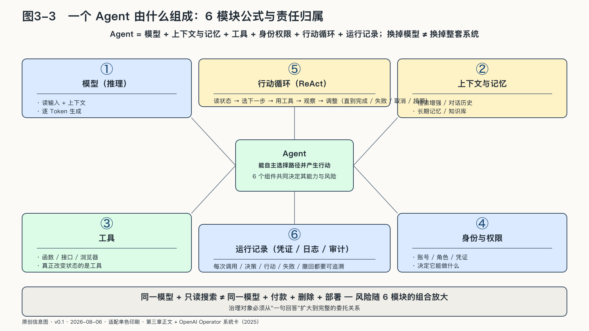

## 一个Agent由什么组成

二〇二三年，美国纽约南区联邦法院处理了一份由律师提交的材料。文书中列出若干看起来格式完整的判例，问题是其中一些判例根本不存在。律师使用ChatGPT进行法律研究，又把流畅输出当成了事实。法院最终制裁律师和律所，并再次确认：工具可以生成文字，向法院提交材料的人仍负有核验责任。[^p4-mata]

在这个阶段，机器获得的是表达能力。人决定是否采用，主要问题是敏感输入去了哪里、事实是否核验、最终由谁批准。

看清一个Agent由什么组成，就是看清权力沿着哪些连接进入现实。组成方式不同，治理的位置就不同——这也是后面所有讨论的地基。

真实工作很快越过了这条边界。基础模型不知道此刻的用户是谁，不知道库存刚刚变化，也不知道哪份制度已经失效。应用必须给它上下文：系统规则、对话历史、检索文档、数据库结果和工具返回。上下文让同一个模型可以扮演客服、程序员或研究助手，也让邮件和网页中的恶意文字有机会伪装成命令。二〇二五年披露的EchoLeak漏洞表明，一封经过构造的邮件可以进入Microsoft 365 Copilot的上下文，影响系统对资料与指令的区分。微软随后修复了漏洞，公开材料没有显示发生大规模客户数据泄露；它仍说明，决定模型看见什么，就是在决定它据以行动的现实版本。[^p6-echoleak]

再往前一步，模型开始调用工具。常见做法是，应用向模型描述函数和参数，模型生成调用意图，外部软件再决定是否执行。模型本身不直接转账，实际改变账户的是支付接口；模型生成删除指令，执行删除的是获得权限的应用。[^p3-function-calling]

这个区分把责任放回系统：参数是否校验，工具是否在白名单中，凭证是否隔离，高风险动作是否需要确认。把边界只写进提示词，相当于让一句话承担门锁的功能。

Agent又把一次调用变成循环：读取状态，选择下一步，使用工具，观察结果，再调整计划，直到完成、失败、取消或被接管。ReAct研究展示了推理与行动交替的基本结构；它不证明机器拥有意识，只说明软件能够围绕目标连续选择路径。[^p3-react]

可以把这种系统拆成一条朴素公式：

> Agent = 模型 + 上下文与记忆 + 工具 + 身份权限 + 行动循环 + 运行记录

模型像司机，工具像车辆，账户像钥匙，权限规定驾照范围，运行记录则是行车记录。换掉模型不等于换掉整套系统；同一个模型只接只读搜索，与接入付款、删除或部署权限，也不是同一种风险。

因此，AI的变化不是Token突然获得了意志，而是Token被逐层接上了资料、身份、工具和现实系统。治理对象也必须从一句回答扩大到完整的委托关系。
