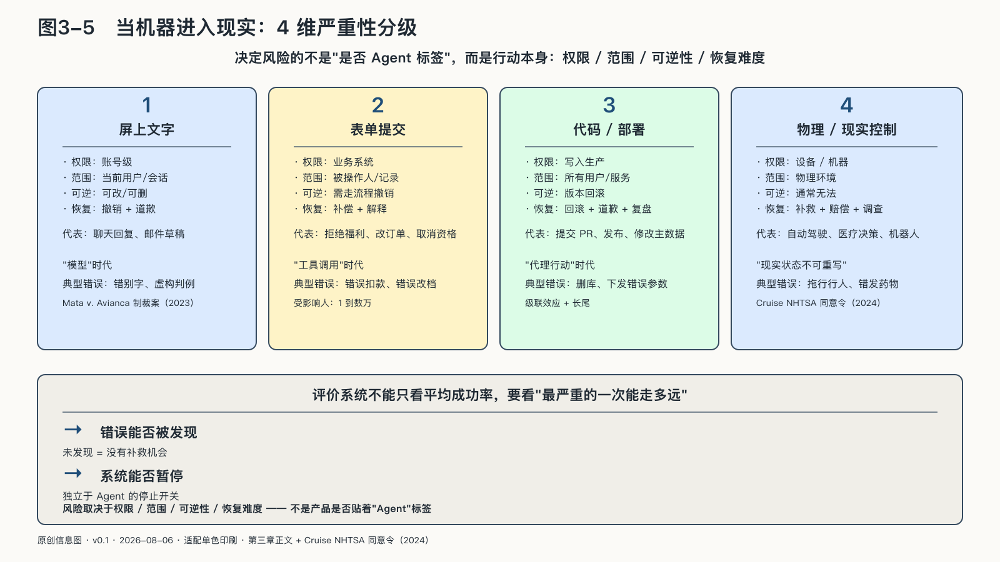
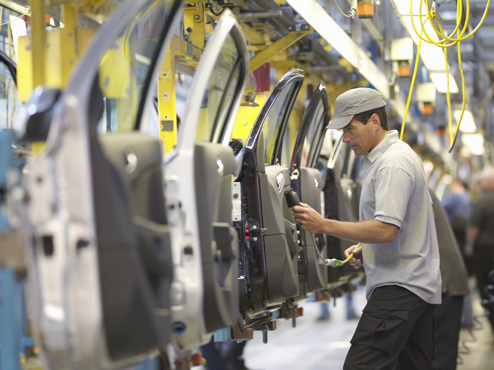

## 当机器进入现实

当模型能够使用浏览器和桌面，它甚至不再等待软件提供专用接口。屏幕上的按钮、表格和输入框，都可能成为行动表面。

此时评价系统，不能只看平均成功率。还要看最严重的一次错误能走多远，错误能否被发现，系统能否暂停，受影响的人能否恢复原状。行动系统的及格线不写在平均成功率里，写在最坏一次的处置里。

自动驾驶不是大语言模型Agent，却提供了一个行动自动化的先例。二〇二三年十月，一名行人被另一辆车撞入Cruise无人驾驶车辆路径；Cruise车辆碰撞后又在事后动作中拖行行人。美国国家公路交通安全管理局二〇二四年的同意令不仅处理车辆行为，也处理事故报告是否完整，并要求持续报告软件更新、安全指标和运营范围。[^p3-cruise]

这个案例不能被写成“聊天机器人失控”。它揭示的是共同结构：软件一旦改变现实，问题就不只在算法当时算得准不准，还在于系统经历过哪些状态、运行哪个版本、组织保存了什么记录、谁能够停止、事故后是否如实说明。

内容可以重写，现实状态往往不能。生成一段错误文字，与拒绝公共福利、提交付款、部署代码或控制机器，不是同一级错误。风险取决于权限、影响范围、可逆性和恢复难度，而不是产品是否贴着“Agent”标签。
