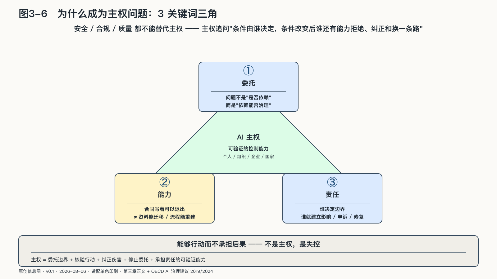

## 为什么这会成为主权问题

为什么不只把前面的问题叫做安全、合规或产品质量，而要使用“主权”这个更重的词？

因为安全问题关心系统会不会造成伤害，合规问题关心它是否遵守规则，质量问题关心它能不能做好。主权追问的是更底层的一件事：条件由谁决定，条件改变后，谁还有能力拒绝、纠正和换一条路。

AI参与判断以后，会组织信息、形成选项、推荐路径。长期委托可能改变个人的记忆与能力，也可能改变组织“事情怎样做”的经验。

更进一步，AI开始代表主体行动。它使用人的账户、组织的数据和公共机构的权力。授权边界一旦模糊，机器行动的作者与责任承担者就会分离。

AI能力又依赖外部基础设施。模型、云、芯片、能源、身份、知识库和工具接口共同组成行动系统。使用者可能很容易开始，却很难把积累的资产、流程和权限关系迁走。

开放虽然扩大了选择，却没有消除依赖。开放权重让更多主体能够运行和改造模型，算力、维护、数据、供应链和安全责任仍要由真实能力支撑。

这四点共同指向一个问题：当人把一部分认知和行动委托给机器，谁决定委托边界，谁能核验它做过什么，条件变化以后，谁还有能力纠正、替换和退出？

之所以必须在这个时代谈主权，是因为两股相反的力量正在同时加速。一边是扩散：斯坦福《二〇二六年人工智能指数报告》记录，受访组织的AI采用率已达百分之八十八；头部模型的领先位置自二〇二五年以来多次交换，没有谁握有永久领先权。[^p1-ai-index-2026][^p2-moving-frontier] 另一边是集中：英国竞争与市场管理局二〇二五年的调查认定，Microsoft与AWS在英国及欧洲经济区云基础设施市场各占约三至四成份额，每年更换云服务商的客户不足百分之一。[^p1-cma-cloud] 扩散让能力人人可得，集中让选择条件悄悄收缩。主权问题正诞生在两股力量的张力里：能力越便宜、越易得，决定它怎样使用、为谁服务的条件就越值钱。

这种可验证的控制能力，在本书中称为AI主权：

> **AI主权，是个人、组织单元、企业与国家在使用外部智能、并把部分判断和行动委托给机器时，仍能决定委托边界、约束和核验行动、纠正伤害、停止委托并承担责任的可验证能力。**

这个定义里的委托、能力和责任，需要分别说明。

第一个是**委托**。使用云服务、商业模型和国际合作，并不与AI主权冲突；要检查的是委托条件能否被理解、约束和重新谈判。

第二个是**能力**。合同写着可以退出，不代表资料能够迁移；文件能够下载，不代表工作流能够重建；模型能够本地运行，也不代表有人能维护。权利必须经过这些实际动作才能成立。

第三个是**责任**。决定系统边界的人，也要为影响、申诉和修复建立程序。AI主权不能成为扩大行动权、同时把后果留给别人的理由。
