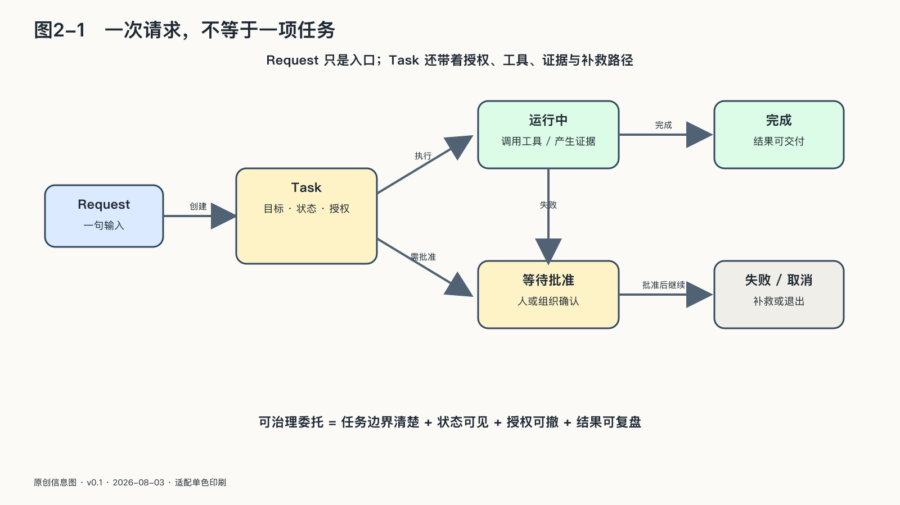

## 一次请求，不等于一项任务

| 工作单位 | 是否有持续状态 | 是否需要授权边界 | 是否可能产生外部副作用 | 完成证据 |
|---|---|---|---|---|
| 请求 | 通常没有 | 只需回答权限 | 通常没有 | 返回内容 |
| 任务 | 有，直到完成、取消或失败 | 需要目标、材料、权限和预算 | 可能有 | 交付物与状态记录 |
| 动作 | 可能有短暂状态 | 需要对象、工具和最小权限 | 经常有 | 执行结果与副作用 |
| 结果 | 是任务的验收状态 | 需要明确谁接受、谁负责 | 取决于结果是否进入现实 | 验收、复核或补救记录 |

我们习惯把使用AI想成一次问答：人发出请求，机器返回结果。这个画面来自搜索框和聊天窗口，也很适合解释早期生成式AI。

但“帮我查一下明天的天气”与“帮我安排下周去北京的出差”并不是同一种东西。

前一句更接近请求。它有明确输入，也有一次性的回答。后一句则是一项任务：系统需要确认出差日期与地点，检查日历，比较交通和酒店，遵守预算，避开不能更改的会议，可能还要等待同事回复。过程中条件会变化，某一步失败后需要决定是重试、换方案，还是回到人这里。

请求关注的是接口：你问了什么，它答了什么。

任务关注的是过程：目标是什么，怎样才算完成，哪些边界不能越过，进行到哪一步，产生了什么副作用，失败后由谁接手。

这一区别非常重要。因为一句自然语言往往只表达愿望，没有表达全部约束。“把会议安排好”没有说明可以邀请谁，是否能移动已有日程，能否向外部人员发送邮件；“帮我买一张机票”没有说明价格上限、舱位、退改要求，也没有说明系统是否可以直接付款。

人类同事遇到这些空白，会凭组织常识询问、等待或克制。Agent却可能根据训练中学到的常见模式补齐空白。补得对，是方便；补得错，就是未经授权替人作了决定。

A2A等智能体协议把Task定义为有唯一标识、状态和生命周期的工作单位。任务可以处于执行中、等待输入、等待授权、完成、失败、取消或拒绝等状态，也可以在较长时间里持续并产生可交付物。协议的存在不代表多智能体协作已经成熟，却说明工程世界正在从“返回一段文字”转向“管理一件正在发生的事”。[^p3-a2a-task]

对普通使用者来说，可以把一项任务理解成一只透明的工作盒子。盒子外面写清五件事：

第一，**要完成什么**。目标应当具体到能够判断是否完成。例如“整理客户投诉”只要求分类和摘要，“处理客户投诉”则可能包含回复、退款和修改账户，两者需要的权力完全不同。

第二，**依据什么材料**。任务可以读取哪些文件、哪些时间范围的数据，哪些来源只能参考，哪些规则具有优先级。否则，过期制度与最新通知可能被混在同一个上下文里。

第三，**能够做什么**。可用工具、对象范围、金额、次数、时间和地域都应有边界。“可以发邮件”过于宽泛；“可以向本项目成员发送草稿，群发和外发需确认”才接近可执行的授权。

第四，**什么必须回来问人**。信息不足、规则冲突、超过预算、涉及不可逆动作或出现异常对象时，系统应当暂停，而不是把犹豫也自动化。

第五，**怎样结束**。完成的证据是什么，失败是否留下副作用，取消后要清理哪些临时权限和中间状态，结果由谁验收。

技术人员可以把这五件事写成一份Task Contract，即任务契约。它不必是一摞法律文件，也不必暴露给普通用户复杂的配置表。它更像人与系统在行动前达成的清楚约定：目标、材料、权限、检查点与结束条件。

任务契约无法消除工作中的所有模糊性，许多任务本来就要边做边学。它要分开可以探索的部分和不得擅自跨越的边界。系统可以比较十条旅行路线，却不能因此获得无限付款权；可以起草三种裁员沟通方案，却不能直接发送；可以找出疑似欺诈交易，却不能仅凭概率冻结账户。

没有这层约定，Agent能力越强，越可能在目标空白处自行扩大任务。任务契约限制的就是这种未经授权的扩张。

任务契约也不等于事无巨细地预编所有步骤。若路径全部能够提前写死，传统工作流可能更可靠。Agent的价值恰恰在于面对变化选择路径；契约要固定的是不可擅改的边界，而不是每一步走法。它允许系统在边界内探索，同时把扩大目标、增加权限和接受不可逆后果的权力留给真正承担责任的人。

### 本节来源

- **A2A Protocol Specification / Core Concepts** — 官方规范把 Task 定义为有唯一标识、状态生命周期与 Artifact 交付物的有状态工作单位；协议互操作不自动提供企业授权与结果可信。来源：[a2a-protocol.org](https://a2a-protocol.org/)。引用编号：`[^p3-a2a-task]`。详见正文与 `05_附录/附录B_精选尾注.md`。
