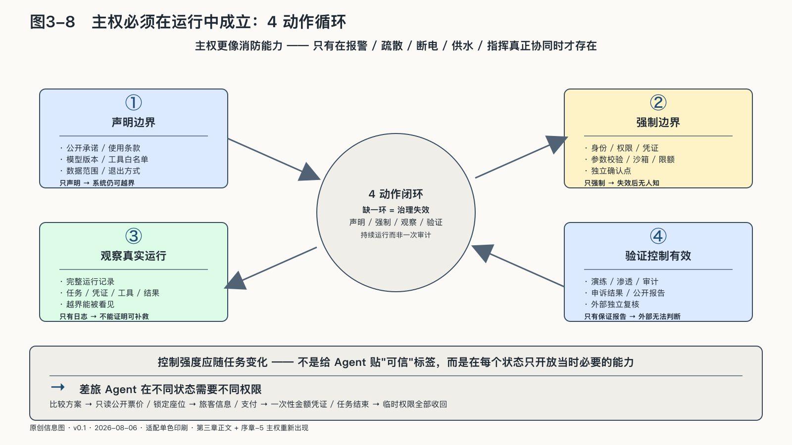

## 主权必须在运行中成立

一家机构可以买下服务器，签署严密合同，把模型部署在自己的机房里。这些都可能增加控制，却不能单独证明主权已经存在。

检验发生在运行时：知识库混入过期文件，能否发现这次回答引用了它；供应商更新模型，原来的评测是否重新运行；Agent准备向三百名客户发信，权限系统能否在发送前停住；主要服务中断，备用路线是否真的能接手；一个人要求解释不利决定，机构能否沿记录还原依据，而不是让模型现场编一段理由。

没有演练过的备用系统、无人理解的开源代码和从未测试的迁移条款，只能证明相关资源或权利名义上存在，不能证明关键时刻可以使用。

规则要进入运行，至少经过四个动作：

> 声明边界 → 强制边界 → 观察真实运行 → 验证控制有效

声明告诉使用者系统承诺什么；身份、权限和流程让系统不易越界；运行记录使越界能够被看见；测试、演练、审计和申诉结果则检验前三者是不是纸面安排。

缺少任何一环，治理都可能失效。只有声明，系统仍能越界；只有强制，控制失效后无人知道；只有日志，不能证明事故能够补救；只有一份保证报告，外部又无法判断测试是否覆盖真正重要的权利。

控制强度还要随任务变化。同一个差旅Agent在“比较方案”阶段只需读取公开票价；进入“锁定座位”时才需要旅客信息；支付时获得一次性金额凭证；任务结束后，临时权限全部收回。给Agent贴一张静态的“可信”标签没有意义，主权落实在每个状态只开放当时必要的能力。

所谓运行时主权，检验的是系统此刻在做什么，为什么需要这项权力，条件变化以后是否还应该继续。它曾经拿到过哪张准入证，回答不了这些问题。总得有人理解这些行动，有权否决，并为后果负责。
