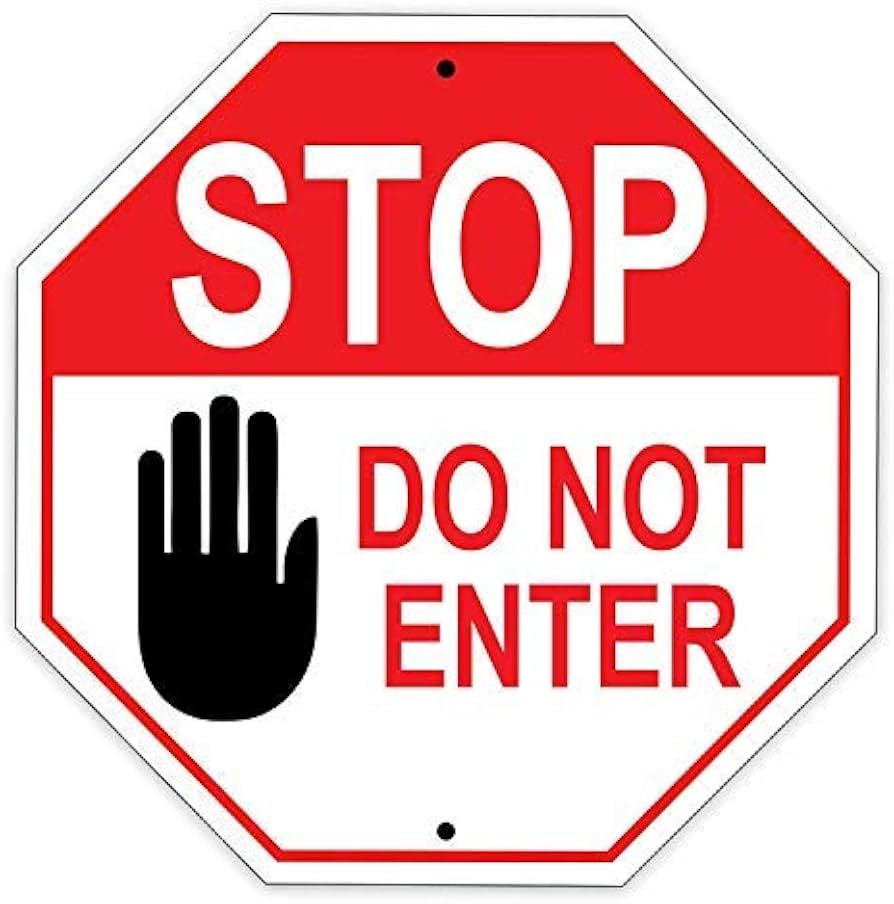

## 谁仍是行动的作者

使用相机的人仍是摄影者，使用导航的人仍要为驾驶负责。AI开始选择步骤和调用工具后，作者与工具之间的边界却会变得模糊。

一封邮件由AI起草、人按下发送，其中的承诺由谁决定？贷款由模型评分、员工照章确认，拒绝依据来自哪里？公共智能体组合多个部门资料后取消资格，公民应向谁要求解释？

如果每个参与者都只负责流程的一小部分，行动仍然会发生，目标设定、最终批准和结果责任却可能散落在系统各处。

AI主权要保护的，是主体继续成为行动作者的可能。所谓作者，不要求亲自完成每一步，至少要求四件事：能够设定目标，能够获得判断所需的证据，能够在关键节点否决或停止，能够对结果给出理由并承担责任。

“人在回路”只有在三项条件同时存在时才有意义：人有足够时间理解，有足够信息判断，也有不会因按下停止键而受惩罚的真实权力。最后一次点击不自动等于人的决定。
