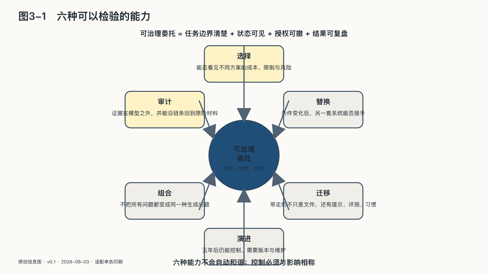

## 六种可以检验的能力

一个供应商可以在合同中写下“客户拥有控制权”，一家机构也可以在汇报中宣布“已经实现主权部署”。到了要换模型、导出资产、追查事故和让备用系统接管的那一天，声明不会自己完成这些动作。

AI主权不能通过采购某件产品一次获得。它至少要能在下面六种能力上接受检验。

### 选择

主体能否看见不同方案的成本、数据条件、限制与风险，并按照自身目标决定路径？一个团队可以数出十个可选模型，如果它们都挂在同一份合同、同一个计费账户和同一种数据格式上，仍然只有一条技术道路。

### 替换

供应商涨价、停服、改变条款或退出某个地区的那一天，另一套系统能否接手？答案不能来自采购文件的承诺，只能来自真实演练。替换不要求功能完全相同，主权底线是关键能力不归零。

### 迁移

原始文件通常可以导出，模型周围的知识库、提示、标签、评测集、反馈、权限关系、操作记录和团队习惯更难迁移。这些材料共同构成智能资产。欧盟《通用数据保护条例》的数据可携带权与《数据法》的云服务切换要求，已经把“能否带走”从产品便利推进为权利和市场结构问题。[^p1-gdpr][^p1-data-act]

### 审计

审计不是问模型“你为什么这样做”，然后相信它临时生成的解释。关键系统需要在模型之外留下证据：输入来源、系统版本、检索材料、工具调用、权限授予、人工确认和外部状态变化。

### 组合

成熟系统很少由一个模型包办一切。云端强模型可以处理复杂推理，本地小模型处理敏感资料，确定性程序完成精确计算，规则守住不可违反的边界，人类负责不可逆决定。组合能力的本质，是不把所有问题都变成同一种生成问题。

### 演进

今天能运行，不代表五年后仍能控制。模型会更新，接口、协议、芯片和法规也会变化。持续保存评测集、记录版本差异、培养维护人员、测试迁移与修订制度，才让主权成为长期能力。

六种能力不会自动和谐。审计需要记录，隐私要求少收集；开放接口有利于迁移，也可能增加攻击面；增加供应商能降低锁定，也会扩大数据流动。AI主权不提供统一满分表，它要求控制与影响相称：系统看得越多、做得越多、动作越难撤销，治理边界就越严格。
