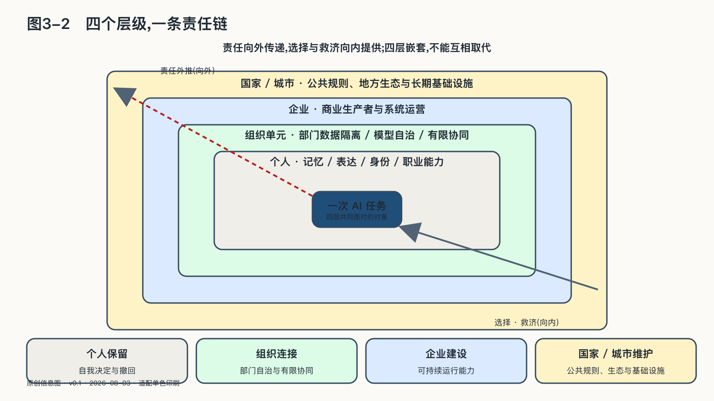

## 四个层级，一条责任链

AI同时进入私人生活、组织协作、市场生产与公共权力，因此主权不能只属于一个层级。分层不是分摊责任，而是让每一层守住别人替它守不住的东西。

**个人层**关心记忆、表达、身份和职业能力。人需要知道AI代表自己做过什么，能够带走自己的材料，撤回权限，也要保留不依赖系统仍可完成关键任务的能力。

**组织单元层**关心企业内部不同责任域怎样自治与协同。研发、财务、法务、人力和销售可以各有数据、模型与AI平台；跨部门任务只交换完成工作所需的请求、制品和证据，不能因同属一家企业就默认共享全部上下文。

**企业层**关心把外部能力变成内部制度。合同、架构、评测、发布、监控、备份与事故响应共同决定，企业是在租用工具，还是拥有可持续的业务能力。

**国家与城市层**关心公共选择。国家要识别芯片、能源、云、模型、标准和人才中的关键节点，城市要把这些资源接入本地生态；二者也要约束公共权力使用AI的方式，让受影响的人能够知道、质疑和申诉。

这里的“四级”按控制半径划分，不按法律主体数量分类。个人层处理自我决定；组织单元层处理企业内部责任域；企业层处理企业整体生产系统及其与外部供应商的关系；国家与城市层处理公共权力、地方生态和长期基础设施。

四层不是从弱到强的等级，也不能互相取代。国家建设算力，不能代替个人撤回授权；个人谨慎，不能补上部门之间的数据边界；企业拥有模型，也不能替公共机构决定公民权利。

它们构成一条责任链：个人保留自我决定，组织单元守住边界并提供专业能力，企业建设整体运行与退出能力，国家维护公共规则和共同基础设施。
