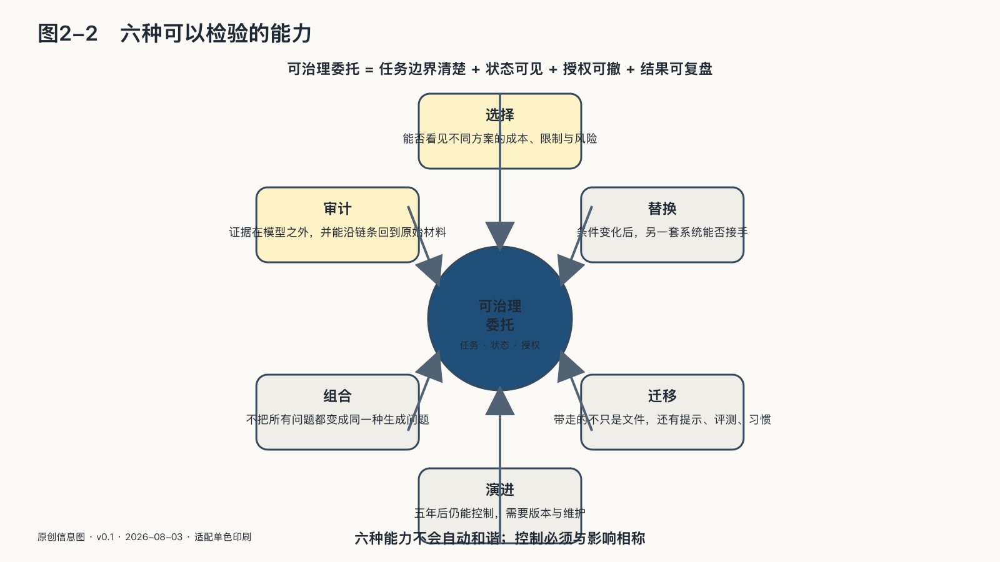

## 六种可以检验的能力

AI主权不能靠态度声明，也不能通过采购某件产品一次获得。下面六种能力用于检验总定义：选择检验主体是否仍能决定路径，替换与迁移检验委托能否结束，审计检验行动能否核验，组合检验边界能否由主体安排，演进检验这些控制能否跨过技术变化。

### 选择

模型菜单的数量不能单独证明存在选择。主体需要看见不同方案的成本、数据条件、限制与风险，并按照自身目标作决定。

十个应用若依赖同一个模型、同一个云和同一种结算规则，仍可能只有一条技术道路。不同品牌之外，还要有能够实际启用的替代路径。

### 替换

替换回答：条件变化后，另一套系统能否接手？

备选方案必须经过演练。对个人，可以把一部分笔记迁到另一款工具；对企业，可以让少量低风险任务定期切换模型；对公共机构，则要验证系统不可用时是否还能维持基本服务。

替换不要求功能完全相同。主权底线是关键能力不归零。

### 迁移

原始文件通常可以导出，模型周围的知识库、提示、标签、评测集、用户反馈、权限关系、操作记录和团队习惯更难迁移。

这些材料共同构成智能资产。欧盟《通用数据保护条例》的数据可携带权与《数据法》的云服务切换要求，已经把“能否带走”从产品便利推进为权利与市场结构问题。法规不会自动完成迁移，但说明退出成本不能永远只由弱势一方承担。[^p1-gdpr][^p1-data-act]

### 审计

审计不是问模型“你为什么这样做”，然后相信它临时生成的解释。

关键系统需要在模型之外留下证据：输入来源、模型版本、检索材料、工具调用、权限授予、人工确认和外部状态变化。日志也不应无限保存；它必须在追责价值、隐私与安全之间明确范围。

### 组合

成熟系统很少由一个模型包办一切。

云端强模型可以处理复杂推理，本地小模型处理敏感资料，确定性程序完成精确计算，规则守住不可违反的边界，人类负责不可逆决定。开源与闭源、云端与本地、模型与传统软件可以共同存在。

组合能力的本质，是不把所有问题都变成同一种生成问题。

### 演进

今天能运行，不代表五年后仍能控制。模型会更新，接口会改变，协议、芯片和法规也会变化。

持续保存评测集、记录版本差异、培养维护人员、测试迁移与修订制度，才让主权跨过一次采购，成为长期能力。

六种能力不会自动和谐。审计需要记录，隐私要求少收集；开放接口有利于迁移，也可能增加攻击面；增加供应商能降低锁定，也会扩大数据流动。AI主权不提供统一满分表，它要求控制与影响相称：系统看得越多、做得越多、动作越难撤销，治理边界就越严格。
