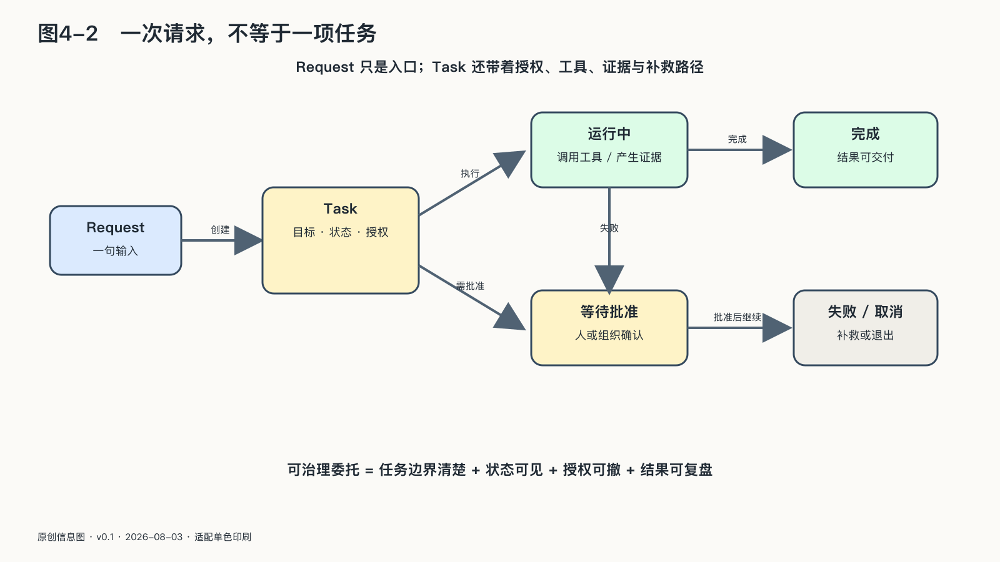

## 任务契约：先约定什么才算完成

一句自然语言往往只表达愿望，没有表达全部约束。AgenticOps的第一份工作，是把愿望变成一项有边界的任务。

任务契约不必写成一摞法律文件，但至少要说清六件事。

第一，**目标与验收**。要完成什么，谁判断完成，完成需要哪些外部证据。“整理客户投诉”只要求分类与摘要；“处理客户投诉”可能包含回复、退款和修改账户，两者需要的权力完全不同。

第二，**依据与时效**。可以读取哪些文件、哪些时间范围的数据，哪些来源只能参考，哪些规则具有优先级。否则，过期制度与最新通知会在同一个上下文里竞争。

第三，**行动边界**。可以使用哪些工具，影响哪些对象，金额、次数、时间和地域有什么上限。“可以发邮件”过于宽泛；“可以向本项目成员发送草稿，群发和外发需确认”才接近可执行授权。

第四，**预算**。预算不仅是Token费用，还包括工具调用、循环次数、运行时间、外部服务、人工复核和失败补救。没有预算边界，Agent可能用更多步骤换取很小的质量增益，也可能陷入持续重试。

第五，**检查点与升级条件**。信息不足、规则冲突、超过预算、出现异常对象或即将执行不可逆动作时，系统应暂停，而不是把犹豫也自动化。

第六，**失败与结束**。任务完成、取消、超时或失败时，哪些临时权限要撤销，哪些中间状态要清理，已经发生的副作用怎样补偿，结果由谁接手。

任务契约不要求事先写死每一步。若路径能够完全预编，传统程序往往更可靠。Agent的价值恰恰在于边做边选择路径；契约固定的是不得擅自跨越的边界，而不是每一步走法。

系统可以比较十条旅行路线，不能因此获得无限付款权；可以起草三种裁员沟通方案，不能直接发送；可以发现疑似欺诈交易，不能只凭概率冻结账户。

任务契约也给评测提供了依据。没有契约，“任务成功率”只是一个漂亮数字：系统可能完成了自己猜测的任务，而不是主体实际授权的任务。
