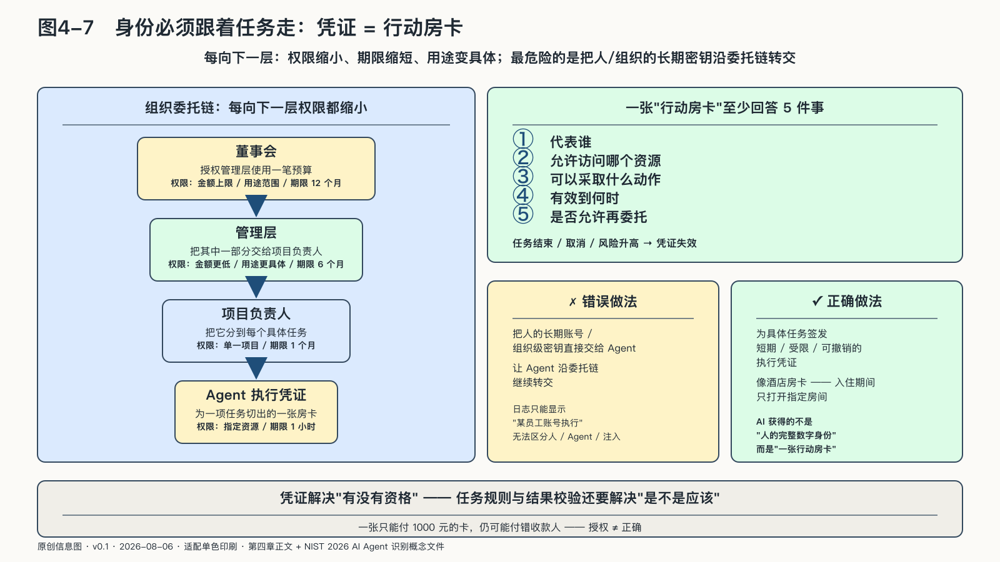
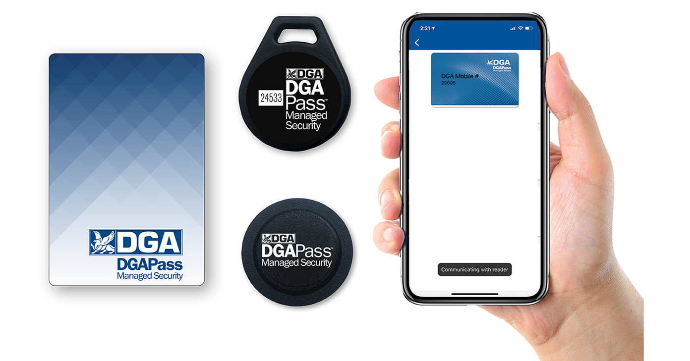

## 身份必须跟着任务走

现实组织中的授权沿层级传递。董事会授权管理层使用一笔预算，经理再把其中一部分交给项目负责人。每向下一层，权限通常都会缩小：金额更低、用途更具体、期限更短。

智能体之间的委托也应如此——委托链每延伸一节，权限就应收窄一圈，而不是原样转交。

假设一个行政Agent能够读取负责人日历并向内部员工发信。它把“寻找共同空闲时间”交给排期Agent。排期Agent只需要读取指定人员在指定日期的忙闲状态，不需要看会议标题，更不需要继承发信权。如果它又调用时区工具，后者只需要城市或时区，不需要得到任何人的日历。

最危险的做法，是把人的长期账号或组织级密钥直接交给Agent，再让它沿委托链转交。日志最后只能显示“某员工账号执行了操作”，无法证明是员工本人、主Agent、子Agent，还是被注入的外部内容触发。

更稳妥的做法，是为具体任务签发短期、受限、可撤销的执行凭证。它至少回答：代表谁，允许访问哪个资源，可以采取什么动作，有效到何时，是否允许再委托。任务结束、取消或风险升高后，凭证失效。

执行凭证很像酒店房卡。住客不会因为订了房，就得到整栋楼的总钥匙；房卡只在入住期间打开指定房间，有些区域还要额外授权。退房以后，卡片失效。AI获得的也不应是人的完整数字身份，而应是为一项任务切出的一张“行动房卡”。

权限还应随着任务状态变化。读取方案时可以只读，准备提交时获得写入草稿的权限，付款前再请求一次金额与收款对象绑定的凭证。扩大目标、增加工具或进入高风险状态，都应重新检查授权，而不是沿用任务开始时的一次同意。

NIST在二〇二六年的概念文件中，把Agent识别、认证、最小权限、代表他人行动、多Agent委托、审计、不可抵赖和提示注入放在同一个问题中。文件仍是标准化议题，不是成熟统一标准，却说明传统“用户登录过”已经不足以回答机器委托的责任。[^p4-nist-agent-id]

凭证只能限制系统被允许做什么，不能保证它做得正确。拿着一张只能支付一千元的卡，仍可能付错收款人。身份与授权解决“有没有资格”，任务规则与结果校验还要解决“是不是应该”。
